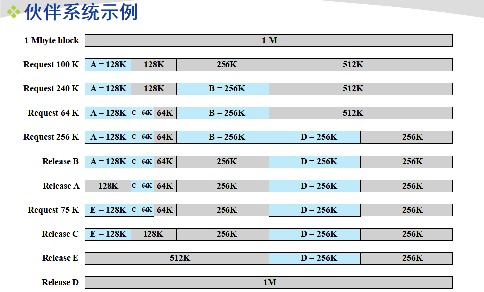
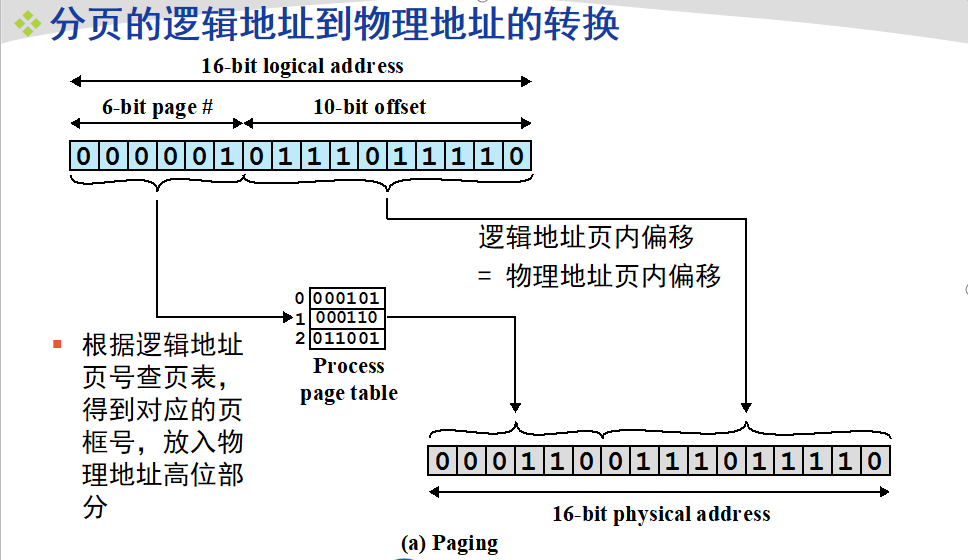
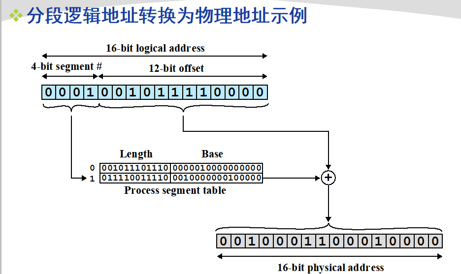
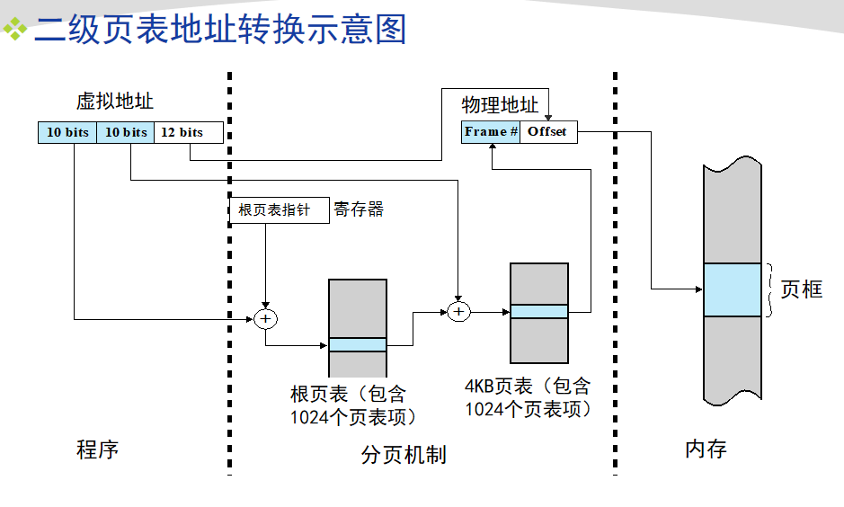
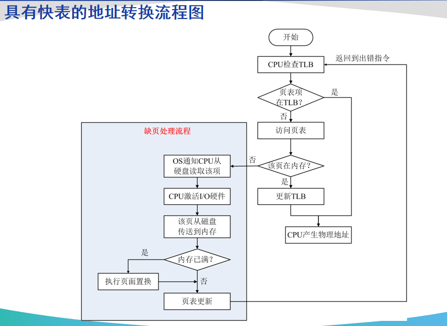
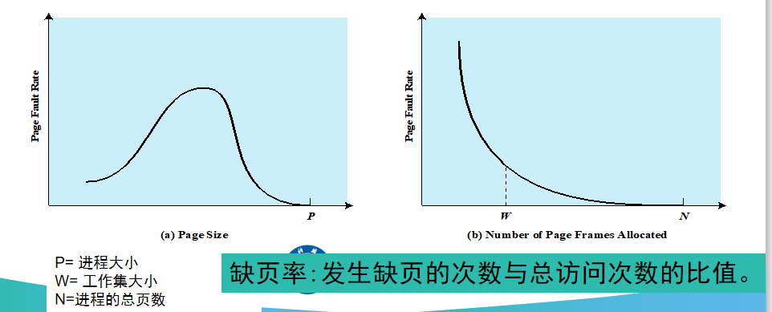
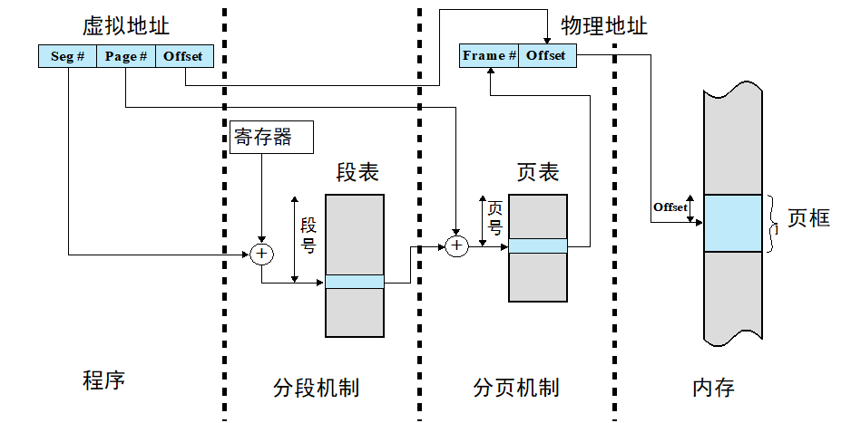

操作系统之内存管理复习记录。

<!--more-->

## 第三章：内存管理

### 程序的装入与链接（了解）

#### 高级语言转化为源代码的步骤

* 编译
* 链接
* 加载（装入）：将可加载模块装入内存、逻辑地址转化为物理地址（地址重定位）

#### 加载方式

* 绝对加载 （编译时执行，如果将来开始地址发生变化，就必须重新编译代码）
* 可重定位加载（静态重定位，加载时执行，不允许程序在内存中移动）
* 运行时加载（动态重定位，执行时执行，支持执行时进程在内存中移动）

#### 链接含义

源程序编译得到一组目标模块，链接程序将这组模块连接，形成加载模块。

#### 链接方式

* 静态链接
* 加载时动态链接
* 运行时动态链接

### 内存管理的需求

#### 内容

* 重定位：逻辑地址转化为物理地址
* 保护 ：进程对内存的使用权限
* 共享：多个进程正在执行同一程序时，允许每个进程访问该程序的同一个副本
* 逻辑组织
* 物理组织

### 内存分区

* 固定分区：分区数量一定，每个分区装入一个进程，但是分区的大小不一定相等。
* 动态分区：（首次匹配、下次/循环匹配、最佳匹配、最差匹配）
  * 首次匹配：从头开始扫描，选择大小足够的第一个块。
  * 下次匹配/循环匹配：从上一次放置的位置开始扫描内存，找到一个可用的块
  * 最佳匹配：选择大小最相近的块
  * 最坏匹配：选择满足要求的最大块
* 简单分页
* 简单分段
* 虚存分页
* 虚存分段

固定分区和动态分区的折中方案：伙伴系统

### 分页

#### 页和页框

页：进程中的块

页框：内存中的块

进程的页装入内存的页框

一个页框的长度和一个页的长度是一样的

#### 页表

* 每个进程都由一个页表
* 含有每个页对应的页框位置
* CPU使用页表生成物理地址
* 存放在内存
* PCB中存有页表的起始地址
* 页表寄存器存有当前运行进程的页表起始地址

#### 分页的逻辑地址到物理地址转换

* 物理地址 = 页框号拼接页内偏移

### 分段

#### 分段的逻辑地址到物理地址的转换

* 段长可变
* 物理地址 = 段基址+偏移量（数值相加）

#### 分页和分段比较

* 页时物理单位，段时逻辑单位

* 页大小固定、段不固定

* 分页的地址空间时一维的，分段的地址空间是二维的，理解参考：

  https://blog.csdn.net/yangkuiwu/article/details/53493458

  就是说编译的时候，虽然分页了但是地址是连续的，而分段情况下，不同的段地址是不连续的。

* 分页不易实现贡共享和运行时的动态链接，而分段可以。

* 进程的内存访问都是逻辑地址，会在运行时动态的转换为物理地址

* 进程分块（页或段）后，不需要连续的位于内存，也不用全部都在内存

* 分页有内部碎片，分段有外部碎片

### 虚拟内存管理

#### 虚拟存储器

#### 相关术语

* 驻留集：任意时刻，进程驻留在内存的部分。
* 内存失效：访问不在内存的逻辑地址（会产生中断）
* 抖动：内存空间几乎占满时，页面被频繁的换入换出
* 局部性原理：存储器的访问呈簇性，很短时间内，CPU只与固定的簇打交道。说明虚存可行。快表和虚存的依据都是局部性原理。

#### 虚拟分页

存在位P：表明对应的页是否在内存
页框号：若页在内存，则有对应的页框号
修改为M：表明相应页上次装入内存到现在是否修改过（决定换出要不要更新）

#### 虚拟分段

每个进程一个段表，每个段表项包括：

* 存在位P，标识相应的段是否位于内存
* 修改位M，标识相应的段是否已被修改
* 其他控制位，如用于保护和共享
* 段基址：相应段在内存中的起始地址
* 段长度

#### 多级页表

| **页表页号（页目录号）** | **页号** | **页内偏移地址** |
| ------------------------ | -------- | ---------------- |

#### 倒置页表（倒排页表）

使用页框号而非页号来索引表项

#### 转换检测缓冲区TLB（快表）

TLB包含了最近用过的页表项，位于高速缓存cache中。

一次内存访问可能产生两次缺页中断：读取所需页表，读取进程页

在快表里一定在内存里

#### 缺页率与页尺寸和分配页框数的关系

#### 段页式

用户的地址空间被程序员划分为许多段，每段划分为许多大小的页。

每个进程一个段表

每个段一个页表

为了获得一条指令或数据，最少访问三次内存。段表、页表、相应存储单元。

#### 分段有利于保护和共享

保护：每个段都有一个长度和基地址，可以控制非法访问

共享：一个段可以在多个进程的段表中被引用，实现共享

### 相关算法

#### 读取策略

决定页何时进入内存：请求调页、预调页

#### 放置策略

决定进程驻留在内存中的位置：首次匹配、循环匹配等

#### 置换策略

淘汰哪个页面用以置换：最佳、最近最少用、先进先出、时钟

* 最佳置换：置换下次访问时间最长的页面
* LRU最近最少用（Least recent use）：内存中最长时间未引用的页面（难实施，开销大）,建立链表，替换的是链表尾部的数据，命中放到链表头部。所以**不用计数**。
* 先进先出：置换驻留时间最长的页面
* 时钟：首次载入内存或被引用使用位 = 1，产生缺页中断时，如果使用位为0，置换，指针前移；为1，置零，指针前移。命中时指针不移动。(开销小)
* 改进CLOCK：引入访问位、修改位

评价指标：缺页率，OPT<LRU<CLOCK<FIFO

##### 页缓冲

未修改的，替换到空闲页链表；修改的，替换到修改页链表，成批写回磁盘。

#### 抖动

系统把即将用到的块换出，又很快要使用，造成页面频繁的换入换出，缺页率增大。

### 驻留集管理

* 页框分配：一个活动分配几个页框，可变可固定
* 置换范围：局部置换（仅产生缺页中断的驻留页）、全局置换

|              | **局部置换**                                                 | **全局置换**                                                 |
| ------------ | ------------------------------------------------------------ | ------------------------------------------------------------ |
| **固定分配** | 分配给进程的页框数固定、从分配给该进程的页框中选择被置换的页 | 无此方案                                                     |
| **可变分配** | 为了保存进程的工作集，分配给进程的页框数不时变化、从分配给该进程的页框中选择被置换的页 | 从内存中所有可用页框中选择被置换的页、这将导致进程驻留集大小不断变化 |

#### 工作集

进程在虚拟时间t的参数为Δ的工作集W（t, Δ ），表示该进程在过去的Δ个虚拟时间单位被访问到的页集合。

#### 清除策略

何时将修改过的页写回辅存。结合页缓冲

#### 加载控制

决定驻留在内存中的进程数量。

##### L=S准则

发生缺页的平均时间L等于处理缺页故障的平均时间S，此时处理器的利用率最大。

## BIOS

* BIOS：基本IO处理系统，开机后计算机系统开始检测各种外设，然后才能加载相应软件执行，BIOS加载bootloader,bootloader加载os
* Bootloader:一个程序,放在硬盘第一个扇区，加载OS，从硬盘到内存

## 系统调用、异常、中断

* 
* 

