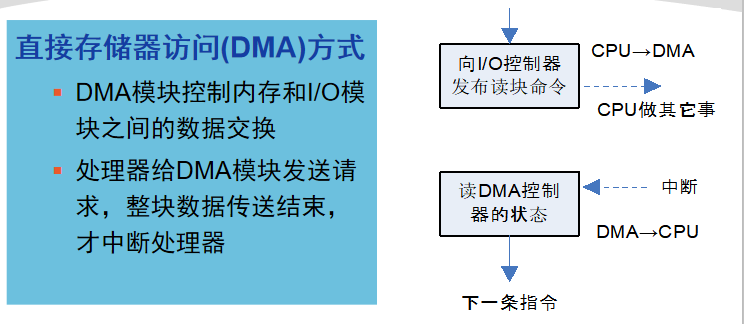

操作系统之I/O管理与磁盘调度复习记录。

<!--more-->

## I/O设备分类

* 人可读（打印机、鼠标、键盘）
* 机器可读（磁盘驱动器、USB密钥、传感器）
* 通信（网卡、调制解调器）

## I/O控制方式

### 程序I/O方式

cpu代表进程给I/O模块发送I/O命令，程序进入忙等，等待操作完成，才能继续执行。

### 中断驱动I/O方式

CPU代表进程给I/O模块发送I/O命令

* 如果I/O指令是非阻塞的，则继续执行后续指令
* 如果I/O指令是阻塞的，当前进程阻塞，调度其他进程。
* 每次传输一个数据即产生中断

### 直接存储器访问（DMA）方式

### DMA与中断驱动I/O方式对比

* 中断频率：
  * 中断驱动I/O：每次传输一个数据产生中断
  * DMA：一块数据全部传送结束中断
* 数据传输：
  * 中断驱动I/O：数据传送在中断处理时由CPU完成
  * DMA：由DMA控制器完成