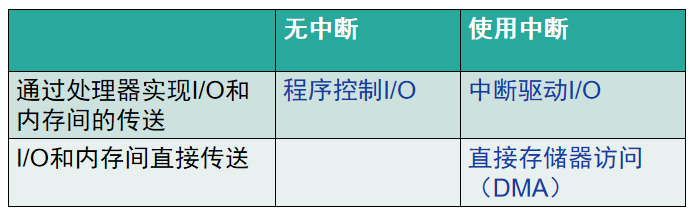
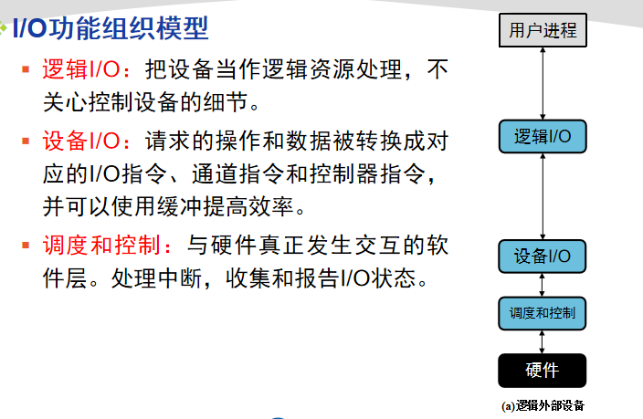
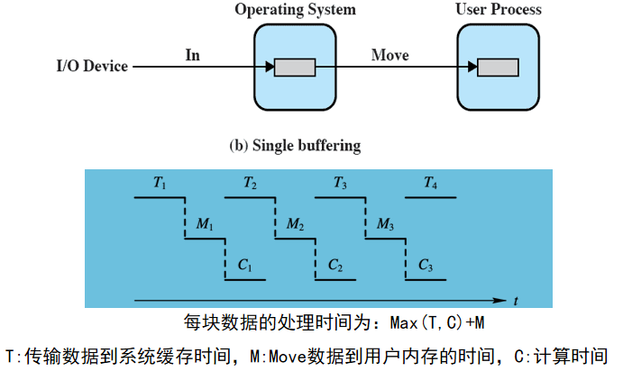
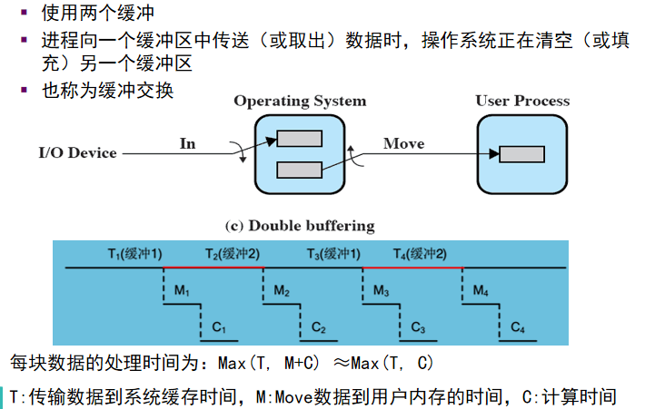
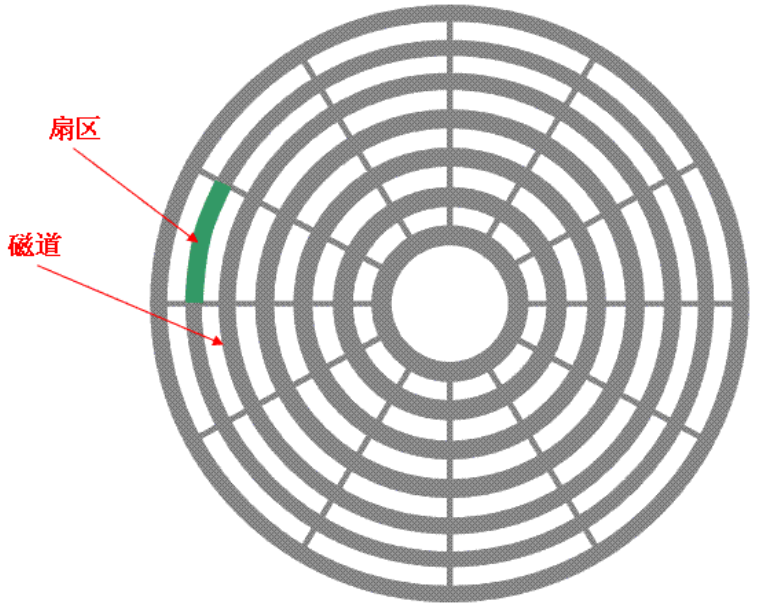
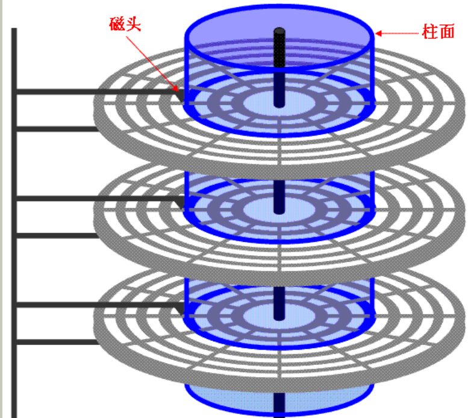
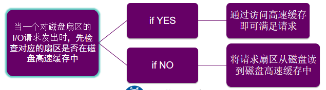

操作系统之I/O管理与磁盘调度复习记录。

<!--more-->

## I/O设备分类

* 人可读（打印机、鼠标、键盘）
* 机器可读（磁盘驱动器、USB密钥、传感器）
* 通信（网卡、调制解调器）

## I/O控制方式

### 程序I/O方式

cpu代表进程给I/O模块发送I/O命令，程序进入忙等，等待操作完成，才能继续执行。

### 中断驱动I/O方式

CPU代表进程给I/O模块发送I/O命令

* 如果I/O指令是非阻塞的，则继续执行后续指令
* 如果I/O指令是阻塞的，当前进程阻塞，调度其他进程。
* 每次传输一个数据即产生中断

### 直接存储器访问（DMA）方式

### DMA与中断驱动I/O方式对比

* 中断频率：
  * 中断驱动I/O：每次传输一个数据产生中断
  * DMA：一块数据全部传送结束中断
* 数据传输：
  * 中断驱动I/O：数据传送在中断处理时由CPU完成
  * DMA：由DMA控制器完成
* 应用：
  * 中断驱动I/O：键盘鼠标
  * DMA：磁盘

### 小结

## I/O设计

### I/O功能组织模型（层次化设计）

### 设备独立性

应用程序独立于具体使用的物理设备

**逻辑I/O模块**允许应用程序使用**设备标识符**及简单的命令与设备打交道。

**逻辑设备表**：逻辑设备名、物理设备名、驱动程序入口地址

**设备I/O模块**将**逻辑I**/O请求和操作转化为响应的**物理**设备的I/O访问控制。

## I/O缓冲

输入请求发出前开始输入传送

输出请求发出后一段时间才输出传送

缓冲区在内存

### 单缓冲

### 双缓冲

### 循环缓冲

使用两个或多个缓冲区，构成循环缓冲

### 缓冲作用

* 缓解I/O设备速度与CPU速度不匹配的矛盾
* 多道程序环境中，缓冲可以提高操作系统的效率，提高单个进程的性能。

### Spooling技术（磁盘中的缓冲）

* 在磁盘中建立I/O缓冲区，缓和CPU高速和I/O设备低速间的矛盾。

* 将一台独占物理I/O设备虚拟化为多台逻辑I/O设备。从而允许多个用户共享一台物理I/O设备。

## 磁盘调度

### 磁盘性能参数

寻道时间Ts

旋转延迟Tr = 1/2r    r为磁盘的转速

传输时间Tt = (b/N)/r

### 磁盘调度策略

* FIFO：先到的请求先访问
* 优先级PRI
* LIFO 后进先出 ：优先处理新到请求
* 最短服务时间优先/最短寻道时间优先SSTF：选择磁道距离最近的
* 电梯算法（SCAN）：磁头折返移动，满足途中的请求，改进：若前方无请求，可提前掉头。特点：偏爱最里和最外的磁道请求
* C-SCAN：限定一个方向扫描

### 黏着现象

进程对同一磁道有较高的访问速度时，磁头臂黏在响应的磁道上不移动。

N-step-SCAN：将请求分为若干子队列，每次使用SCAN处理一个队列，N = 1,FIFO;N很大，SCAN。

FSCAN：使用两个队列，扫描开始前，请求都在一个队列中，扫描过程中，新到的请求加入另一个队列，一个队列处理完才会处理另一个。

## 磁盘高速缓存

位于内存的缓冲区，包含磁盘某些扇区的副本。

### 置换算法

* LRU最近最少用（无计数，常用）
* LFU最不长使用（有计数，不常用，存在问题，前期频繁访问但后期不在使用的块不会被置换出来）