操作系统之文件系统复习记录。

<!--more-->

## 概述

### 术语

* 域：基本数据单元、包含一个值、定长或变长
* 记录：一组域的集合，视为应用程序的一个单元、定长或变长
* 文件：一组相似记录的集合、实体、通过名字访问、访问控制的实施级
* 数据库：数据的集合、一种多种文件组成、数据元素间关系明确、供不同应用程序使用

## 文件的逻辑结构

**堆文件、顺序文件、索引顺序文件、索引文件、HASH文件**

### 堆文件

* 最简单
* 按时间先后顺序收集数据
* 每条记录由一串数据组成
* 目的是积累大量数据并保存
* 穷举查找方式检索
* 变长记录、可变域集

### 顺序文件

* 最常见
* 记录固定格式
* 记录长度相同，域的位置、长度相同
* 每个记录一个关键域，唯一标识了记录
* 记录按照关键域存储排序
* 用于批处理应用
* 在磁盘或磁带上易存储

### 索引顺序文件

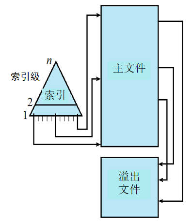

利用关键字找到该记录组中第一个记录的表项，然后顺序查找所要求的记录

增加了支持随机访问的索引和移除文件

### 索引文件

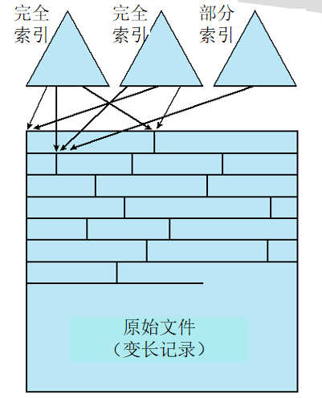

* 通过索引访问记录
* 变长记录
* 完全索引：主文件中每条记录的索引项
* 部分索引：感兴趣域记录的索引项
* 用于及时性要求高，对数据处理少的应用程序（订票系统，商品库存控制系统）

### 直接文件或散列文件（HASH文件）

* 直接访问磁盘上任意地址已知的数据块
* 基于关键字的散列

## 文件目录

文件目录是指：为实现“按名存取”，必须建立文件名与辅存空间中物理地址的对应关系，体现这种对应关系的数据结构称为文件目录。

### 对目录的操作

查找、创建、删除、修改、显示

### 目录单元的内容

基本信息、地址信息、访问控制信息、使用信息

| 基本信息                   | 地址信息                         | 访问控制信息               | 使用信息                                               |
| -------------------------- | -------------------------------- | -------------------------- | ------------------------------------------------------ |
| 文件名、文件类型、文件组织 | 卷、起始地址、使用大小、分配大小 | 所有者、访问信息、权限信息 | 数据创建时间、创建者、最近访问日期、当前文件活动信息等 |

### 目录结构

单级结构、两级结构、层次结构（树状结构、无循环图结构）

#### 单级结构

整个文件系统建立一张目录表，每个目录项对应一个文件

#### 两级结构

主目录：每个用户一个目录项，提供地址和访问控制信息

用户目录：用户文件的简单列表，文件名唯一

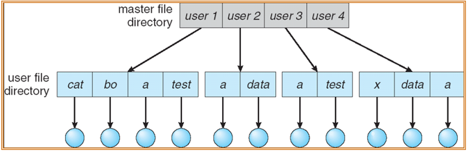

#### 树状结构

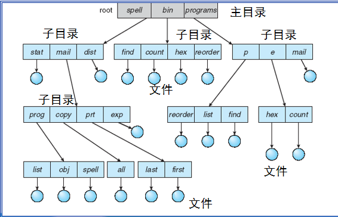

路径定位、文件可重名，路径唯一

绝对路径：从根目录开始指定的目录

相对路径：从工作目录开始

#### 无循环图结构

允许多个目录项指向同一个数据或目录文件，实现目录或数据文件的共享（Unix使用）

目录项的删除：存在多个引用时，只删除引用；所有引用都被删除后才删除文件。

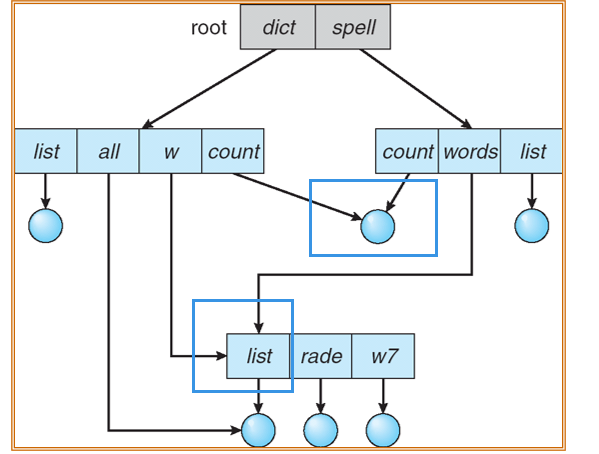

## 文件共享

一份物理存储，多个别名。

在Unix中，通过链接实现文件共享（软链接、硬链接）

### 硬链接

* 只允许文件链接，同一文件系统下
* 维护链接计数，减至0，文件被删除
* 若有文件链接到此文件，则该文件不能删除

### 软链接

* 链接的是目录或文件路径
* 建立符合链接文件（快捷方式）
* 可跨文件系统，跨计算机
* 访问速度相对慢，但灵活性大

## 辅存管理

### 文件分配

辅存中，文件由许多块组成

操作系统或文件管理程序为文件分配块

#### 分配方式

* 预分配：要求文件创建是声明文件的最大尺寸，但是程序的大仙难以估计，用户或程序往往估大文件的尺寸，

* 动态分配：只有在需要时才给文件分配空间

#### 分区大小

* 大小可变的大规模连续分区
* 块（大小固定）

### 文件的物理结构（文件的分配方法）

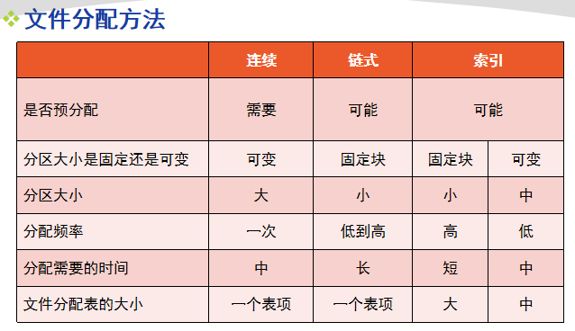

#### 连续结构（连续分配）

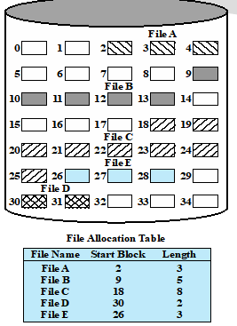

采用预分配，在创建文件时，分配一组连续的块。适合顺序文件，检索容易。存在外部碎片。

#### 链式结构（链式分配）

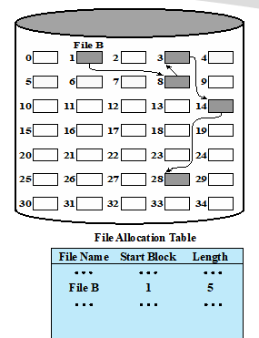

存在问题：多个块离散分配，使得局部性原理不再适用，若要一次读入多个块，要访问磁盘的不同部分。

#### 索引结构（索引分配）

##### 基于块的索引分配

* 索引作为单独的块保存
* 文件分配表的表项指向索引块

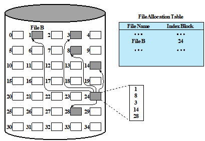

##### 基于长度可变分区的索引分配

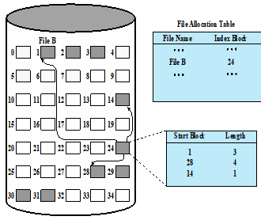

每个分区有一个表项，提高局部性，经过整理可以减少索引数量，基于块的索引分配不行

### 空闲空间管理

* 位示图：001100111....向量表示磁盘每一个块的使用情况，1表示已用。

*  链接空闲分区：使用指向每个空闲区的指针和长度值，链接空闲区

* 索引：将空闲区视为文件，使用索引表，基于大小可变的分区

* 空闲块列表：每个块指定一个序号，所有空闲块的序号保存下来。

### 卷

逻辑磁盘，一组扇区的集合，物理上可不连续，对OS或应用程序来说连续

## UNIX文件管理

### 6种文件类型

* 普通文件
* 目录文件：包含文件名列表和指向索引节点的指针
* 特殊文件：不含数据，提供物理设备映射到文件名的机制
* 命名管道：进程间通信的基础设施
* 链接文件：一个文件的别名
* 符号链接：一个数据文件，包含链接文件的文件名

OS通过索引节点（Inode）管理所有文件

### 索引节点

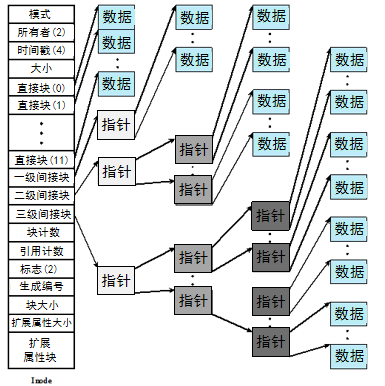

文件的分配以块为基础、动态分配，索引节点包含n个直接指针和三个间接指针，每个指针指向一个块，块可能是数据，也可能是一组指针。

## 补充

* 源程序、可执行文件、库函数等所采用的都是无结构的文件形式，即流式文件。其文件的长度是以字节为单位的。