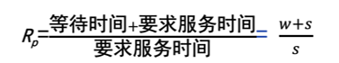
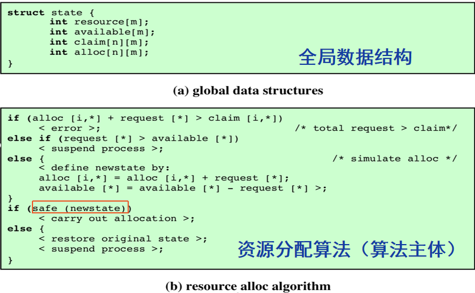
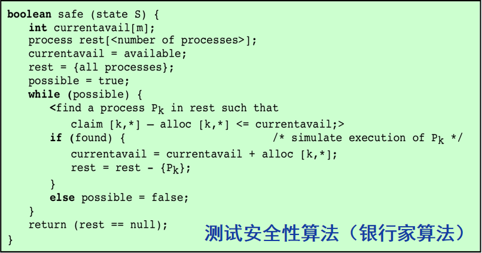

操作系统之进程管理复习记录。

<!--more-->

# 进程的描述与控制

当处理器开始执行一个程序的代码时，我们把这个执行的实体称为进程。进程组成：程序代码、相关数据、PCB

## 进程是什么

### 进程控制块

元素：标识符、状态、优先级、程序计数器、内存指针、上下文数据、I/O状态信息、记账信息

### 进程与程序

#### 进程的基本特征

* 动态性：本质特征，由生命周期
* 并发性：重要特性
* 独立性：进程空间地址相互独立，除非采用进程间通信手段
* 异步性：按各自独立、不可预知速度推进

#### 进程和程序比较

* 进程是执行的程序实例
* 进程 = PCB + 程序 + 数据
* 引入进程的目的：使多道程序能够正确的并发执行
* 程序使静态实体，进程具有动态性
* 进程和程序不存在一一对应的关系

## 进程状态

### 交换

把内存中的一个进程的部分或全部移动到磁盘，进程变为挂起状态。

#### 挂起程序的特征

* 程序不能立即执行
* 进程可能在等待一个事件，也可能没有
* 进程被代理设置为挂起状态，代理可能为进程自己，父进程，OS
* 需要显示命令状态转换，否则进程将一直处于挂起状态
* 进程挂起的原因：交换、OS原因、用户请求、定时、父进程请求

## 进程描述

### 操作系统的控制结构

OS使用表来记载各资源的信息

* 内存表：分配给进程的内存、外存，内存块或外存块的保护属性，外存管理所需信息

* I/O表：管理I/O设备
* 文件表：文件是否存在，位置，状态等属性
* 进程表：管理进程

### 进程的控制结构

进程映像：程序、数据、栈、属性（PCB）

#### PCB中的信息

* 进程的标识信息：进程标识符，父进程标识符、用户标识符
* 处理器状态信息：用户可见寄存器、控制和状态寄存器、栈指针
* 进程控制信息：调度和状态信息、数据结构、进程间通信、进程特权、存储管理、资源所有权和使用情况

## 执行模式

### 内核

OS中包含重要系统功能的部分，常驻内存

#### 内核功能

* 资源管理：进程管理、存储管理、I/O设备管理
* 支撑功能：中断处理、时钟管理、记账功能

### 处理器的执行模式

#### 用户模式

具有较少优先权的模式，用户程序在该模式下运行

#### 内核模式

与OS相关的处理器模式，具有更多优先权、运行OS内核、部分内存和指令只允许特权模式（内核模式）访问或运行

#### 采用两种模式的原因

保护OS和重要操作系统表（如pcb）不受程序干扰

#### 模式切换

程序状态字寄存器存在执行模式的指示位。

* 用户调用OS服务或中断触发系统例程，内核模式
* 系统服务返回用户进程，用户模式

### 进程的创建

* 给进程分配唯一的进程标识符
* 给进程分配空间
* 初始化PCB
* 建立链接，插入到就绪或就绪/挂起链表
* 建立或扩充其他数据结构

### 进程切换

保存处理器上下文——更新当前进程PCB——PCB移动到相应队列——执行另一个进程——更新器PCB——更新内存管理数据结构——恢复选择进程上下文。

#### 系统中断

* 普通中断：因外部事件产生（时钟中断、I/O中断、内存失效）、时间片（中断前最大运行时间）
* 陷阱：进程内部的错误或异常

#### 进程切换的时间

进程切换是调度另一个就绪进程占用处理器执行

* 普通中断
* 陷阱
* 系统调用

### 模式切换

用户模式和内核模式间切换

用户—>系统：中断出现、程序计数器设置为中断处理程序的开始地址、用户模式切换到内核模式，以便中断处理能执行特权指令。

#### 进程切换和模式切换对比

中断、模式切换不一定导致进程切换（如I/O中断，某些系统调用（getpid）不一定会进程切换）

但是进程切换会伴随模式切换，因为要切换到内核模式下完成调度。

模式切换可在不改变进程状态的情况下出现。

## 线程

调度并分派的单位是线程。

资源所有权的单位是进程。

每个线程有：执行状态、线程上下文、执行栈、用于局部变量的静态存储空间、与进程内其他线程共享的内存和资源访问

### 线程的优点

* 创建线程的时间少
* 终止线程时间少
* 同一进程的线程切换时间少
* 提高了不同执行程序间的通信效率

### 线程分类

* 用户级线程：管理由应用程序完成，内核意识不到线程存在，切换不需要内核模式特权，但系统调用会引起进程阻塞，不能利用多处理器技术
* 内核级线程：管理由内核完成；内核可以把多线程调度到多处理器上；一个线程阻塞，内核可以调度同一进程的其他线程；内核例程本身也可以多线程（提高了内核效率）；需要模式的切换
* 混合方法：线程创建在用户空间完成；线程调度同步由应用程序完成（不需要模式切换，开销小），部分线程映射到内核线程（线程阻塞不引起进程阻塞）

# 进程调度

## 调度的类型

### 长程调度

决定那个程序可以进入系统中处理。从作业队列中选择作业来**创建进程**。

### 中程调度

交换功能的一部分。

### 短程调度

决定下次执行哪个进程，最频繁，导致进程阻塞或发生抢占（时钟中断、I/O中断、系统调用、信号）时调用短程调度程序。

## 调度的规则

### 基本概念

* 响应时间：用户提交请求到接收响应
* 截止时间：任务必须开始或完成的最迟时间
* 周转时间（驻留时间）：进程提交到完成
* 带权周转时间：周转时间/服务时间
* 平均带权周转时间：带权周转时间的均值

### 规则分类

* 面向用户（进程的行为）、面向系统（处理器利用率、进程的完成速度）
* 与性能相关、与性能无关
* 优先级使用

## 调度的决策模式

* 抢占（剥夺）、非抢占（非剥夺）；抢占是指：进程的执行可能被OS中断，转为就绪态，发生在新进程到达、中断发生、时钟中断。
* 选择函数：关键的参数有，等待时间、执行时间、所需总服务时间。

## 调度算法

### 先到先服务

非抢占；对长进程有利，不利于短进程（短进程的带权周转时间大），利于CPU繁忙型进程，不利于I/O繁忙型进程。

### 时间片轮转

抢占式；用于分时系统或事务处理系统；时间片略大于一次典型的交互时间，利于CPU繁忙型进程（可充分利用时间片），不利于I/O繁忙型进程（I/O阻塞后加入就绪队列重新排队）。

### 短作业优先

前提：执行时间已知（估计执行时间）。非抢占；有利于短进程

### 剩余时间最短者优先

在短作业优先的基础上加入了剥夺机制。**抢占发生在：新进程加入就绪队列时。**仍会存在长进程饥饿现象。

### 响应比高者优先

非抢占；当前进程执行完毕或者阻塞时发生调度。

### 反馈调度法

多级队列，惩罚长进程

队列内按时间片抢占，第$i$级队列时间片为$2^i$，被抢占后进入下一级队列，上级队列空闲才会轮到下级队列调度。

长进程仍可能饥饿。

## 实时系统和实时调度

理解

# 进程同步

## 并发的原理

### 相关术语

* 临界资源：不能同时访问，必须互斥访问的资源，如打印机
* 临界区：访问临界资源的**代码**。任意时刻只能由一个进程运行这段代码。
* 忙等：进程等待进入临界区，会继续消耗处理器时间。
* 互斥：进程在临界区访问共享资源，其他进程不能进入该临界区。
* 活锁：（相互谦让）两个或两个以上的进程为响应其他进程而持续改变自己状态，但是不做有用工作的情形
* 死锁：（都不让，相互僵持）两个或两个以上的进程因等待其他进程做完某些事而不能继续执行的情形。
* 饥饿：（排很久，还是等不到）一个具备执行条件的进程，被调度程序无限期的忽视而不能调度的情形。

## 互斥

### 互斥的要求

* 空闲让进：临界区空闲，有进程申请就立即进入
* 忙则等待：每次一个进程进入临界区
* 有限等待：不会死锁或者饥饿
* 让权等待：进程不能长时间在临界区阻塞等待

### 互斥的实现

#### 软件方法

不能解决忙等现象

#### 硬件方法

* 中断禁用：进入临界区之前，屏蔽中断，出临界区再启用中断。用于单处理器系统
* 专用机器指令：动作再一个指令周期中执行，不会被打断。

## 信号量

可以基于硬件的方式保证进程互斥使用semWait或semSignal操控信号量。

### 信号量分类

二元信号量（01）、计数信号量

* 都使用队列来组织等待信号量的进程
  * 强信号量：使用FIFO方式从队列里移除
  * 弱信号量：未规定阻塞进程从队列里移除的顺序。

### 经典问题

#### 生产者/消费者问题

#### 理发师问题

#### 读/写问题

#### 哲学家就餐问题

## 管程

一种程序设计语言结构，采用了集中式的进程同步方法，提供了与信号量同样的功能，但更易于控制。

# 死锁

一组相互竞争系统资源或进行通信的进程的永久阻塞

## 资源的分类

* 可重用资源：处理器、内存、设备、信号量
* 可消耗资源：I/O缓冲信息

## 死锁的条件

### 必要条件

| 互斥                         | 占用且等待                                 | 不可抢占                           |
| ---------------------------- | ------------------------------------------ | ---------------------------------- |
| 一次只有一个进程可以使用资源 | 进程等待其他资源时，继续等待已经占用的资源 | 不能强行抢占其他进程已经占用的资源 |

### 充分条件

* 循环等待

## 死锁的解决

### 死锁的预防

防止死锁产生条件的发生。

* 间接方法：防止三个必要条件中的任何一个
  * 防止互斥：互斥不能禁止
  * 防止占用且等待：一次申请所有资源
  * 防止不可抢占：如果申请资源时被拒绝，就释放原占用资源，或者OS要求释放
* 直接方法：防止循环等待，定义资源请求序列，进程对资源的请求按资源类型的序号线性提出。

### 死锁的避免

允许必要条件，分配决策保证不产生死锁

#### 银行家算法

* 安全序列：按照一个资源分配序列不会产生死锁的序列。
* 安全状态：至少存在一个安全序列是所有进程能运行结束。不安全状态不一定是死锁状态。
* 实质在于：避免系统进入不安全状态
* 进程必须事先声明每个进程的请求最大资源

### 死锁的检测和解除

不限制资源访问，不约束进程的行为，检测死锁的存在并尝试解除。

#### 死锁检测算法

跟银行家算法一样，不同的是死锁的预防是一种保守的策略，所以如果预分配进入不安全状态，就不分配，虽然不安全状态是可以通过释放资源进入安全状态的。但是对于死锁的检测，如果当前已经是不安全状态了，就是死锁了，需要进行解除。

#### 资源分配图化简

* 找出全部请求都能满足的进程节点，删除该进程的所有请求边和分配边
* 重复，如果所有进程都鼓励，则不存在死锁，这种图成为可完全化简图

#### 解除死锁

撤销进程、回退、抢占