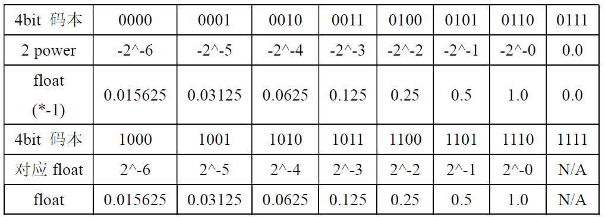
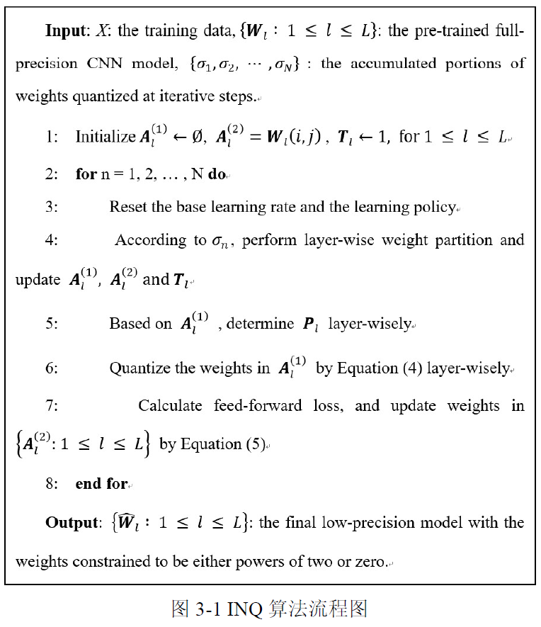

<!--more-->

## 压缩算法

将所有权重都表示为2的幂次方形式，参考IQN算法

将IQN所得的训练权重，用4bit形式表示（基于数据码本）

### IQN算法

## 量化

### 背景

量化一般分两种形式，一种是训练后量化，指的是训练后的模型中的权重从float32量化到int8，并以int8形式保存，实际推理时，还需要反量化为浮点数运算。另一种时训练时量化，前向传播时，采用量化后的权重和激活值，反向传播过程仍对float类型权重梯度下降，推理时全部使用int8计算。

深度神经网络主要计算是浮点数之间的乘加运算，在FPGA程序中可以利用移位计算代替乘法计算，做到用少量的逻辑资源实现，提高FPGA计算能力，降低功耗。

对**激活值**进行量化，可以将卷积运算通过移位来完成。

将FP32的激活值量化到int8范围内-128~127之间（char类型）。

### 特征图量化方法

* 求一组数据最大值 $max_a = max(abs(T_a))$，a表示activations，T表示张量
* 求量化系数$Q_a = round(log_2(128/max_a))$
* 因此量化后的数据可以表示为$a_{int8} = round(2^{Q_a}.a_{fp32})$，这样$a_{int8}$的最大值就是128
* 则卷积计算可以表示为：
  * $\left[a_{i n t 8}\right]_{2}=\sum\left[a_{i n t 8}\right]_{1} * f i l t e r * 2^{-Q_{a_{1}}} * 2^{Q_{a_{2}}}$
  * $\left[a_{i n t 8}\right]_{2}=\sum\left[a_{i n t 8}\right]_{1} * 2^{-n} * 2^{-Q_{a 1}} * 2^{Q_{a 2}}$
  * $[a_{int8}]_2$是量化后输出层的值，$[a_{int8}]_1$是输入层的值
* 假设压缩后的weights表示为：
  * $weights = (-1)^s*2^m$
* 量化后的feature_map表示为：
  * $Qfeature = feature*2^{-Q}$
* 假设原来feature map的通道数为n，weight大小为k*k，则卷积可以表示为：
  * $result =\left(\sum_{i=1}^{N} \sum_{j=1}^{k * k}\right. feature [i][j] * weight \left.[i][j]\right)+ bias$
  * 代入后可表示为：$Qresult * 2^{Q 2}=\left(\sum_{i=1}^{N} \sum_{j=1}^{k * k}\right.Qfeature \left.[i][j] * 2^{Q 1} *(-1)^{s} * 2^{m}\right)+bias $
  * 因此：$Qresule = \sum_{i=1}^{N } \sum_{j=1 }^{k * k} Q \text { featur } e[i][j] * 2^{Q 1-Q 2} *(-1)^{s} * 2^{m} + bias*2^{-Q2}$
  * 上式前面那一部分可以表示成以为运算： $Qresult\_part=\sum_{i=1}^{N} \sum_{j=1}^{k * k}(Qfeature[i][j] \ll(Q 1-Q 2+m)) *(-1)^{s}$

