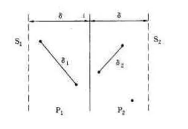
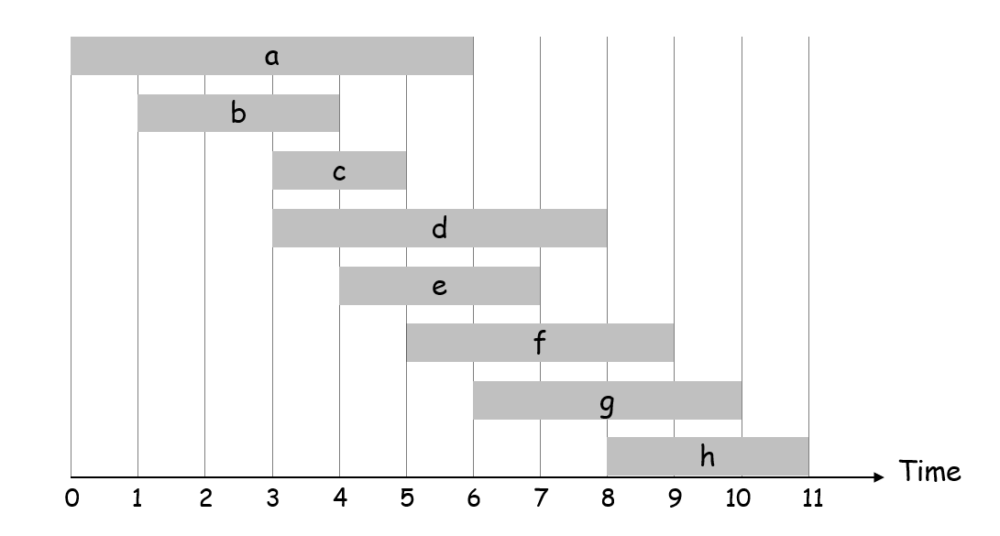
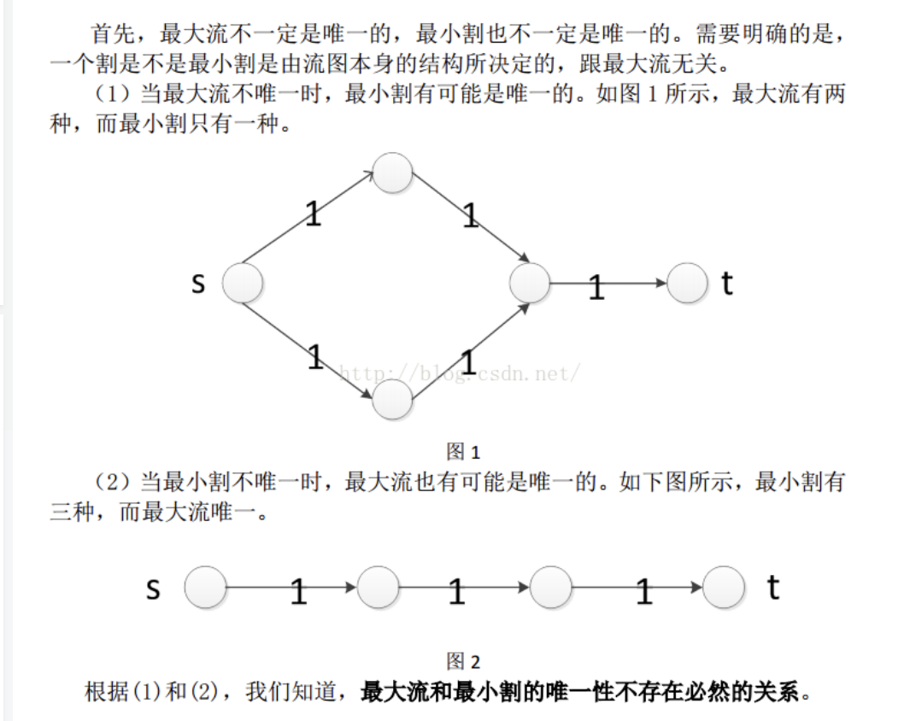
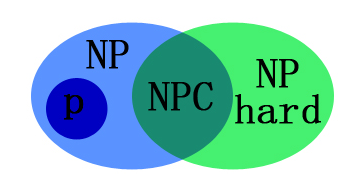
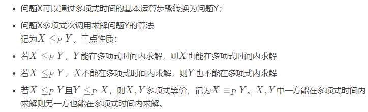
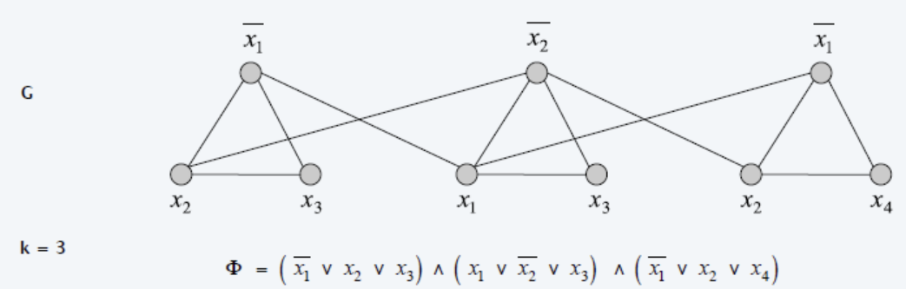
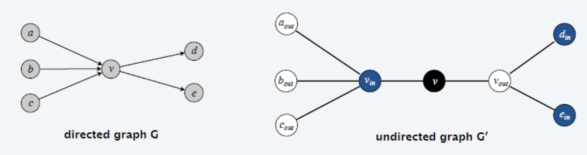
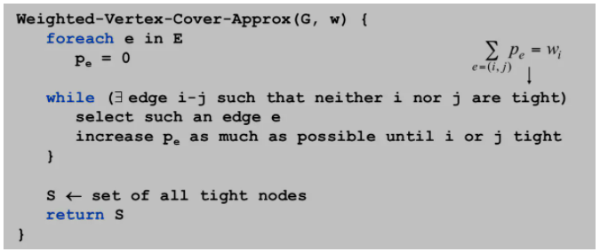
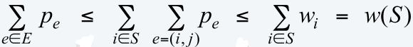
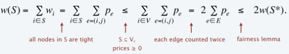

复习大纲

<!--more-->

## 基础知识

### 引论

#### 判断性问题和优化问题

NPC问题一般是判定性问题

### 分治法

#### 逆序对

一个数的序列中排在前面的数比排在后面的数要大的话则称为一对逆序，即$i < j , a [ i ] > a [ j ]$

问下面这个序列中存在多少对逆序：5,4,8,10,2

考虑，将序列L拆分成两半A、B，考虑现在逆序对存在与两个，A内部的，B内部的，AB之间的。先假设，可以通过递归的方式找到AB内部的逆序对，然后AB内部如何交换都不会影响AB间逆序对的结果。现在问题就是找AB之间的逆序对。

如果AB是有序的，我们对于所有A中的元素$a_i$求出它在B数组所有插入的位置j，(j前面的就是数组B中比$a_i$小的数，也就是逆序)，然后对j求和即可。这个过程就是归并排序的规程。

```c++
#include <bits/stdc++.h>
using namespace std;
const int maxn = 5e5+10;
int a[maxn], temp[maxn];
long long res = 0;  // 记录逆序对数目
void mergeSort(int left, int right) {
    if(left<right) {
        int mid = (left+right)/2;
        mergeSort(left, mid);
        mergeSort(mid+1, right);
        int index = 0, i = left, j = mid+1;
        while(i<=mid && j<=right) {
            if(a[i]<=a[j]) temp[index++] = a[i++];
            else {
                temp[index++] = a[j++];
                res += mid-i+1; // 当a[i]>a[j]时形成逆序对，数目为左子序列长度减去i再加上1
            }
        }
        while(i<=mid) temp[index++] = a[i++];
        while(j<=right) temp[index++] = a[j++];
        for(int i = 0; i < index; i++) a[left+i] = temp[i];
    }
}
int main() {
    int n;
    cin >> n;
    for(int i = 0; i < n; i++) cin >> a[i];
    mergeSort(0, n-1);
    cout << res << endl;
    return 0;
}
```

#### 最近点对

给定$n$个二维平面上的点，求一组欧几里得距离最近的点对。

首先暴力就是枚举两两点间的距离，取最小值，复杂度$O(n^2)$

对点集$S$进行拆分，分两部分求最近点对$L,R$，设L和R中最小点对距离为l,r，LR间最小距离为d,则归并需要求解min(l,r,d)

如何合并两个集合找到最小点对距离

设δ = min(l,r)，则点集合间最小点对只可能存在分界线附近范围内：



对于L范围内的点p，只选取R范围内长为2δ，宽为δ的点进行计算


#### 主方法求解递归关系式

> **定理4.1（主定理）** 令 $a≥1$ 和 $b>1$ 是常数，$f(n)$ 是一个函数，$T(n)$ 是定义在非负整数上的递归式：
>  $T(n) = aT(n/b) + f(n)$
>  那么$T(n)$有如下渐进界：

1. 若对某个常数 $ε>0$ 有$ f(n) = O(n^{log_ba}-ε)$，则$ T(n) = Θ(n^{log_ba})$ 。
2. 若 $f(n) = Θ(nlog_ba)$，则$ T(n) = Θ(nlog_ba lgn)$ 。
3. 若对某个常数$ ε>0 $有 $f(n) = Ω(nlog_ba+ε)$，且对某个常数 $c<1$ 和所有足够大的 $n$ 有 $af(n/b) ≤ cf(n)$，则 $T(n) = Θ(f(n))$ 。

### 动态规划

#### DP适合求解什么问题

* DP问题的一般形式是求最值，最长递增子序列，最小编辑距离
* 可以通过穷举得到结果，但是存在最优子结构，子问题间相互独立
* 最优子结构作为dp问题的必要条件，遇到最值问题，可以往DP想

#### 最优子结构

从子问题的最优结果推出更大规模问题的最优结果

找最优子结果的过程，其实就是证明状态转移方程正确性的过程。

#### 思路

* 找**状态**和**选择**
* 明确dp数组的含义
* 根据选择，中出状态转移的逻辑

#### DP数组的遍历方向

* 遍历过程中，所需的状态必须是已经计算出来的
* 遍历的重点是存储结果的位置

#### 带权区间调度问题

> 一系列工作，每个工作有自己的：开始时间、结束时间、权值，求一组工作子集，使得工作时间不重叠，且总的权值最大。



$dp[i]$代表第i个区间的最大权重和，则$dp[i] = max(dp[i-1], interval[i].w+dp[interval[i].p]);$

其中

```c++
struct Interval
{
	int s, f, w;  // 区间开始时间、结束时间和权重
	int id, p;  // 区间编号和该区间前一个不冲突的区间.是[1,i-1]这i-1个区间内与i不冲突的结束时间最接近i开始时间的区间
}interval[maxn];
```

#### 最大子数组和

给定一个整数数组 `nums` ，找到一个具有最大和的连续子数组（子数组最少包含一个元素），返回其最大和。

https://leetcode-cn.com/problems/maximum-subarray/
$dp[i] = max(nums[i], nums[i] + dp[i - 1])$

$dp[i]$代表以i结尾的最大连续子数组

最后求完dp数组，还需要再遍历一次数组，找到最大值返回

#### 最大子矩阵和


#### 01背包


#### 找零钱

给你一个整数数组 `coins` 表示不同面额的硬币，另给一个整数 `amount` 表示总金额。求凑硬币的组合数。

每个物品数量无限，就是完全背包问题

##### 状态、选择

状态：背包的容量、可选择的物品

选择：装进背包、不装进背包

##### dp数组

有两个状态，因此需要一个二维的dp数组

定义dp\[i\]\[j\]：只使用前i个物品，当背包容量为j时，可以装满背包的方法

##### 状态转移逻辑

* 不把第i个物品装入背包：$dp[i][j] = dp[i-1][j]$

* 把第i个物品装入了背包：$dp[i][j] = dp[i][j-coins[i-1]]$
* 因为要求方案数：$dp[i][j] = dp[i-1][j] + dp[i][j-coins[i-1]]$

#### 编辑距离

给你两个单词 word1 和 word2，计算出将 word1 转换成 word2 所使用的最少操作数 。(可以用来衡量两个串的相似度)

可以对一个单词进行如下三种操作：

插入一个字符
删除一个字符
替换一个字符

https://leetcode-cn.com/problems/edit-distance/

解决两个串的dp问题，一般都是用两个指针$i,j$分别指向两个字符串的最后，一步步往前走，缩小问题的规模。

编辑距离中，不同操作代价可能不同，可以自己定义插入或删除一个字符的代价为$a$，替换一个字符的代价为$b$。

```c++
int minDistance(String s1, String s2) {
    int m = s1.length(), n = s2.length();
    int[][] dp = new int[m + 1][n + 1];
    // base case 
    for (int i = 1; i <= m; i++)
        dp[i][0] = i;
    for (int j = 1; j <= n; j++)
        dp[0][j] = j;
    // 自底向上求解
    for (int i = 1; i <= m; i++)
        for (int j = 1; j <= n; j++)
            if (s1.charAt(i-1) == s2.charAt(j-1))
                dp[i][j] = dp[i - 1][j - 1];
            else               
                dp[i][j] = min(
                    dp[i - 1][j] + 1,//插入
                    dp[i][j - 1] + 1,//删除
                    dp[i-1][j-1] + 1//替换
                );
    // 储存着整个 s1 和 s2 的最小编辑距离
    return dp[m][n];
}

int min(int a, int b, int c) {
    return Math.min(a, Math.min(b, c));
}
```

#### 高楼扔鸡蛋

#### 时间复杂度

动态规划的时间复杂度是伪多项式时间

伪多项式时间：若一个数值算法的时间复杂度可以表示为输入数值N的多项式，则称其时间复杂度为**伪多项式时间**。

对背包问题来说，假设n为物品数量，W为背包容量，那么算法的时间复杂度并不是O（nW）,因为n是输入规模，而W并不是输入规模，W是背包的容量，他只输入一个值，这个值的规模应该是这个数所占用的二进制位数。

所以背包问题还是NPC的。

### 贪心

贪心的本质是选择每一阶段的局部最优，从而达到全局最优

#### 贪心求解什么问题

手动模拟下，感觉局部最优是可以推出全局最优，找不到反例，可以试试贪心

非要证明的话考虑数学归纳法和反证法

#### 找零钱

假设硬币有5种面值，$1 , 5 , 10 , 25 , 100 $，每种硬币无限个，如何用**最少**数量的硬币来凑出给定数值M。
这种面值的硬币组合，可以贪心求解。

因为每个面值都能被比他小的面值整除。

#### 分发饼干

https://leetcode-cn.com/problems/assign-cookies/

对每个孩子$ i$，都有一个胃口值 $g[i]$，这是能让孩子们满足胃口的饼干的最小尺寸；并且每块饼干$ j$，都有一个尺寸 $s[j]$ 。如果 $s[j] >= g[i]$，我们可以将这个饼干 $j$ 分配给孩子$ i$ ，这个孩子会得到满足。你的目标是尽可能满足越多数量的孩子，并输出这个最大数值。

#### 摆动序列

https://leetcode-cn.com/problems/wiggle-subsequence/

给一个序列，找出这个序列的最长摆动子序列长度

##### 思路1 贪心

**贪心策略下**，局部最优：删除单调坡度上中间的节点，整体最优：整个序列有最多的局部峰值，从而达到最长摆动序列。

所以统计峰值就可以了，删除都不用做

##### 思路2 DP

状态：数组下标，峰谷

选择：当前数作为峰时，以前面哪个作为谷。当前数为谷时，以前面哪个作为峰

```c++
dp[0][0] = dp[0][1] = 1;
for (int i = 1; i < nums.size(); ++i) {
    dp[i][0] = dp[i][1] = 1;
    for (int j = 0; j < i; ++j) {
        if (nums[j] > nums[i]) dp[i][1] = max(dp[i][1], dp[j][0] + 1);
    }
    for (int j = 0; j < i; ++j) {
        if (nums[j] < nums[i]) dp[i][0] = max(dp[i][0], dp[j][1] + 1);
    }
}
return max(dp[nums.size() - 1][0], dp[nums.size() - 1][1]);
```

#### 最大子序和

给定一个整数数组 nums ，找到一个具有最大和的连续子数组（子数组最少包含一个元素），返回其最大和。

##### 思路1 贪心

局部最优：连续和为负数时就立刻放弃，重新计算连续和

全局最优：选择最大的连续和

##### 思路2 DP

`dp[i] = max(dp[i - 1] + nums[i], nums[i])` 以i结尾的最大连续子数组的和

`result = max(dp)`

## 网络流

> 最大流问题和最小割问题及其算法，增广链添加的过程

### 概念

#### 最大流

源点s，到汇点t的最大流量

#### 最小割

割是一种点的划分方式，比如划分为点集S,T，割的容量指，从S到T的边的容量之和，最小割是让这个容量最小，最小割并不唯一。

#### 最大流最小割定理

最小割的容量等于最大流的流量



#### 任意流和割

对于任意流f，任意割（A,B），流的大小为流出A的流量与流入A的流量之差。

## NP完备性理论

### 多项式规约

假设已有解决一个问题的子程序，利用他可以在多项式时间内解决另一个问题的规约方法。

问题X可以规约到问题Y：

h(X) = g(f(Y))，其中g(.)是多项式的，不考虑f子程序运行所用的时间。

### 常见规约问题

#### 基本概念

* 多项式时间

多项式是指解决问题的时间随输入规模呈多项式的变化

考虑一个问题，验证一个团是不是最大团是多项式的吗？答案不是

比如，当前团为k，那枚举k+1的团是否存在并不是多项式的，虽然他的复杂度是$O(n^{k})$，但是这里k也是输入的规模

* P问题：能在多项式时间内解决的问题
* NP问题：能在多项式时间内验证的问题
* NPC问题：首先是NP问题，所有NP问题都可以规约到他
  * 假设要证明问题$Y$是一个$NP-completeness$问题
    1. 首先证明问题$Y$是一个$NP$问题；
    2. 选择一个已知的$NP-completeness$问题$X$；
    3. 将问题$X$多项式归约到问题$Y$，即证明。（即说明了求解问题$Y$不比求解问题$X$简单）
* NP-Hard问题：NP-hard满足NPC问题的第二条定义但不一定满足第一条，np-hard的意思就是所有的np问题都不比它简单




理一下：首先，N，NP，npc都是指判定性问题，NP-hard可能


* 独立集：图 G 中两两互不相邻的顶点构成的集合
* 团：是图中顶点的一个子集，这个子集中的点都相互连接（无向图的最大团==该无向图补图的最大独立集）
* 点覆盖：无向图G的一个点集，使得该图中所有边都至少有一点端点在该集合内
* 集合覆盖：有n个子集，这几个子集的并集作为全集，找到一个最小的子集组合，使得他们的并集等于全集

#### 规约



* A要规约到B
* 构造图 G ，存在问题 A 的解集；

* 在图 G 基础上，构造图 G’（常添加边或点），使得问题 A 的解集能反应在 G’ 中问题 B 的解集（注意两个问题解集的规模 k 一定要有确定的联系）；

* 图 G 中存在问题 A 的解集 S，当且仅当图 G’ 中存在问题 B 的解集 S’ ；

* 规约的正确性，需双向证明。

##### 独立集到点覆盖

S是独立集，则V-S是顶点覆盖

##### 顶点覆盖到集合覆盖

构造点覆盖的顶点是集合覆盖问题中的子集和，顶点覆盖的元素相当于集合覆盖中子集和的元素。

##### 3-SAT到独立集



##### 顶点覆盖到支配集


##### 有向哈密尔顿到无向哈密尔顿

> 给定一个有向图G，需构造无向图G'



有向图中的一个顶点拆成三个，一个接受入度，一个接收出度，则G‘中的哈密顿环按蓝黑白或者白黑蓝的顺序，去掉蓝和白就是有向图中的哈密顿环。

##### 	3-sat到有向哈密尔顿环

？？？

##### 子集和到分区问题

> 给定一个集合 S = {w1 , w2 , … , wn}，子集和为 W，需构造集合 S’，使得集合 S 存在一个子集之和为 W，当且仅当集合 S’ 存在一个 Partition

构造分区问题集合$ S’ = \{v1 , v2 , … , vn, vn+1, vn+2\}$，其中

$v1 = w1，v2 = w2, … , vn = wn，vn+1 = 2∑wi - W，vn+2 = ∑wi + W$

##### 子集和到背包问题

> 给定一个集合 S = {w1 , w2 , … , wn}，子集和为 W，需构造集合S‘，使得子集和问题有解当且仅当S'存在一个背包实例

构造背包实例，第i个物品的重量和价值等于wi，背包的U=V=W

#### 自规约

* 设该判断算法为 A ，利用算法 A 判断出图中存在…(大小为k的…)；

* 删除一条边或点(看具体是边集还是点集的问题)，对删除边/点后的图运行判断算法 A ；

* 若图中还存在…(大小为k的…)，则从图中彻底删除该边/点；若不存在，则把该边/点加入集合 S 中；

* 对所有的边/点调用算法 A 执行上述操作，最终得到的集合 S 就是求解问题的解。

##### 点覆盖问题

##### 哈密顿环问题

##### 3-color问题

##### 最长路问题

## 近似算法

### 负载均衡

### 带权顶点覆盖问题

顶点覆盖要求图中所有边至少有一个端点在集合内，带权顶点每个点有一个权值，要求这个集合的权值之和最小

#### 2倍近似算法-竞价法



二倍近似证明：

引理：

对于一个任意合法的竞价边权的和，都小于等于一个点覆盖的点权和



则，



S里的邻边边权和<=所有点的邻边边权和

所有的点邻边边权和=2倍的边权和

#### 整数规划模型


## 参考

https://zhuanlan.zhihu.com/p/106624574

https://chengyong.blog.csdn.net/article/details/100806815
