编译基本过程：词法分析、语法分析、语义分析、中间代码生成、编译优化、目标代码生成

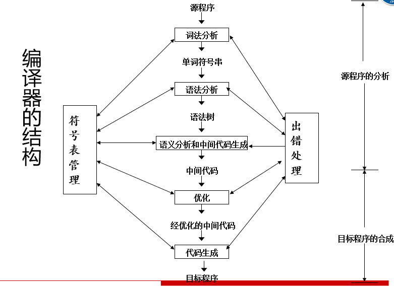

<!--more-->

## 数据类型

对存储器中存储数据的抽象，包括一组值和一组操作

### 分类

* 内部数据：语言自己定义的数据
* 用户定义数据：运行程序员利用数据的**聚合机制**，定义复杂的数据对象
  * 笛卡尔积：例如  正多边形的   边数X边长
  * 有限映像：通过下标变量对应的函数
  * 序列：任意多个数据项，但类型相同
  * 递归：通过指针构建
  * 判定或：union，c语言中union使用同一段内存
  * 幂集：类型T的元素所有子集的集合
* 抽象数据类型

### C语言中的数据类型

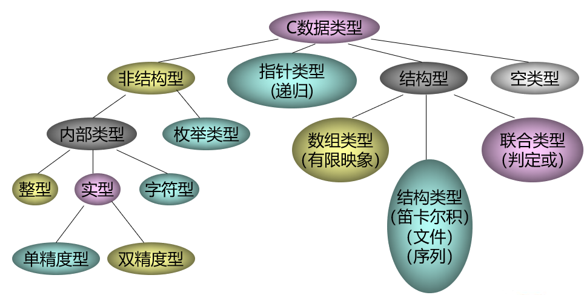

### 类型检查

对语言按照数据类型分类：

* 无类型语言
* 强类型语言：所有类型检查要在编译时完成（C）
* 弱类型语言：类型检查要全部或部分要在运行时完成（PASCAL）

### 类型转换

类型转换分为：

* 扩展：整型—>实型
* 收缩：实型—>整型

语言应该提供的类型转换机制：

* 隐式转换（自动）
* 显示转换（强制）

### 类型等价

`T1`和`T2`是两个类型
T1的任何值都可以赋给T2的变量，反之亦然
T1实参可对应T2形参，反之亦然
则T1和T2类型等价（相容）

### 实现模型

数据类型的实现模型，用**描述符**和**数据对象**表示

* 描述符：描述数据对象的属性数据
* 数据对象：存储区及其内容

绑定：一个对象与其某种属性建立起某种联系的过程。

#### 内部类型

描述符一般由类型和一个指针组成：

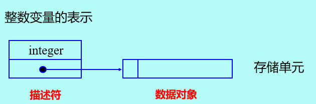

#### 用户定义类型

* 笛卡尔积：

  * 各成分顺序排列，每个成分占整数个可编址存储单元
  * 描述符包含：类型名，构造符，若干三元式（选择符名、域类型、指针），每个域对应一个三元式

  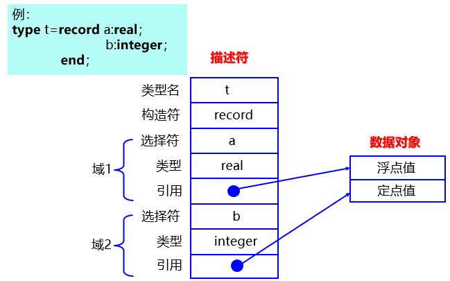

* 有限映像：

  * 每个成分分配整数个可编址的存储单元
  * 描述符包含：类型名、构造符、定义域的基类型、下界、上界、成分类型、（每个成分占有的）单元个数、首地址

  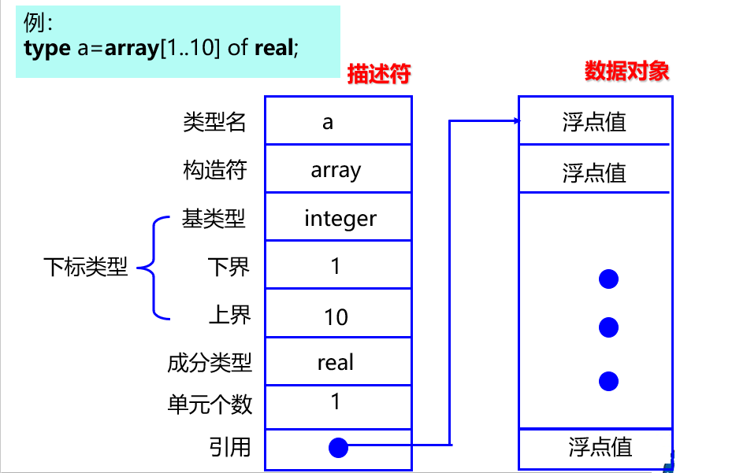

* 序列

  静态描述符+动态描述符+堆

  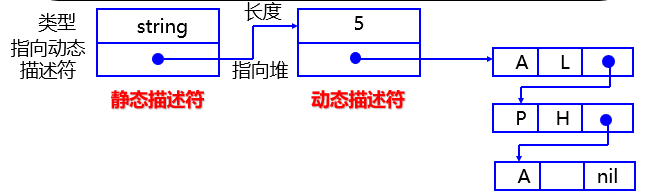

* 判定或：

  * 对判定或类型变量分配的空间要足够容纳需要最大空间的变体的值
  * PASCAL的变体记录包括：描述符、数据对象、case表、若干变体描述符

  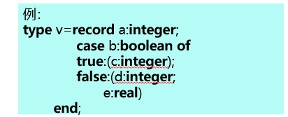

  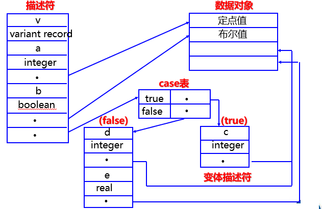

* 幂集

  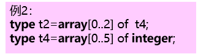

  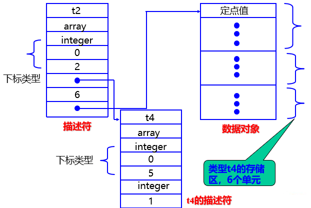

## 控制结构

语句级控制结构分为：顺序、选择、重复

重复的两种控制方式：计数器制导（for循环知道循环次数）、条件制导（while循环）

单元级控制结构：显示调用、异常处理、协同程序、并发单元

区分协同程序和并发单元：协同程序是伪并行的，是交错执行。

异常处理：被调用单元是隐含的

## 程序语言设计

### 语言的定义、语义描述、语法描述

语言 = 语法 + 语义

可以从生成（文法）和识别（语法图）的角度描述语法。

文法和语法图是语法的等价表示。

语义尚无描述工具，一般用自然语言。可以用操作语义学的抽象机行为来描述语法单位的作用和意义。

* 抽象机GAM：

  存储器、控制器、处理器、指令指针ip

  存储器分为代码区和数据区

  GAM启动后，将依次完成以下工作：

  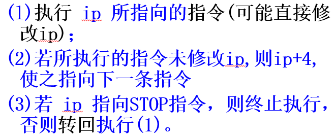

### 形式语言与文法

文法的形式定义：G = （VT,VN,S,P） 终结符集、非终结符集、文法开始符号、产生式集。

a->b   产生式箭头后面的叫候选式

#### 文法分类

https://blog.csdn.net/whuexe/article/details/8710723

* 0型文法
* 1型文法：上下文有关文法
* 2型文法：上下文无关文法
* 3型文法：正规文法

#### 推导

推导就是用产生式的右边代替产生式的左边

推导的逆过程——归约

最左推导：替换最左边的非终结符

最右推导（规范推导）：替换最右边的非终结符

直接推导：推导一次

广义推导：推零次或若干次

句型和句子：

句型是推导过程中生成的产生式

句子是只有终结符的句型

#### 语言的定义

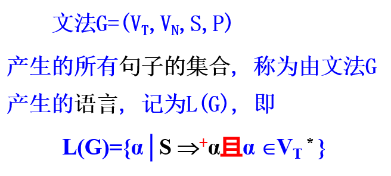

一个文法只能产生一个语言，一个语言可以由多个不同的文法产生。若L(G) = L(G‘)，则称G和G'是等价文法。

#### 语法树（推导树）

非终结符—>终结符

推导树不是唯一的，语言二义性，一个句子可能有两颗不同的推到树。

推导树的边缘：所有叶节点从左到右的连接

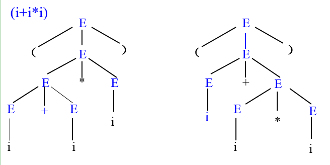

## 编译概述

一些基本概念：

* 翻译：一种语言编写的程序转换成另一种语言编写的程序，实现翻译的程序叫翻译程序
* 从高级语言到低级语言的翻译叫做编译
  从汇编语言到机器语言的翻译叫做汇编
* 编译程序：高级语言—>低级语言 
* 汇编程序：汇编语言—>机器语言
* 宿主语言：编写编译程序的语言
* 宿主机：运行翻译程序的机器
* 自驻留：宿主语言编写的编译程序能生成其宿主机上执行的机器代码
* 交叉编译：编译程序生成的不是宿主机的机器代码
* 自编译：编译程序是用源语言写的

### 编译和解释

#### 编译执行

先将源程序翻译成目标程序，再执行目标程序得到结果

#### 解释执行

直接由解释程序对源程序进行分析、执行并得到结果

解释执行无需生成目标代码、易于实现、易于移植，需要边翻译边执行，优化难，执行效率低

#### 如何区分

看进程：是目标程序还是解释程序

如c语言程序的进程就是 程序.exe，而python是python解释器pyhon.exe

## 词法分析

输入源程序的符号串，输出单词流

工具：状态转换图

## 语法分析

对经过词法分析的符号串，按照文法判断，看是否构成正确的句子，给出语法树和错误信息。

### 自上而下

前提条件：消除左递归和无公共左因子

* 递归下降分析
* 预测分析

#### 递归下降分析

* 消除左递归：目的是避免产生无限推导，而不能匹配任何字符

https://blog.csdn.net/liyun123gx/article/details/19924993

**P→Pα1 / Pα2 /…/ Pαn / β1 / β2 /…/βm**

改为：

**P→β1 P’ / β2 P’ /…/βm P’**

**P’** **→α1P’ / α2 P’ /…/ αn P’ /ε**

* 提取公共左因子：目的是消除回溯，拥有唯一的推导过程

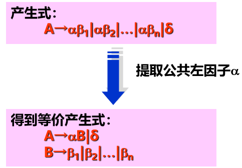

#### 预测分析法

表驱动，由 下推栈、预测分析表、控制程序 组成

* first(α)集：α（任意符号串）所有可能**推导出的**首终结符（或ε）的集合，首符集
* follow(A)集：所有句型中紧跟在A后面出现的终结符的集合，跟随符集

##### first集构造

* 终结符的first集是它本身
* 非终结符的first集是这个字符可能能推导出的第一个非终结符，包括直接推导出的、间接推导出的

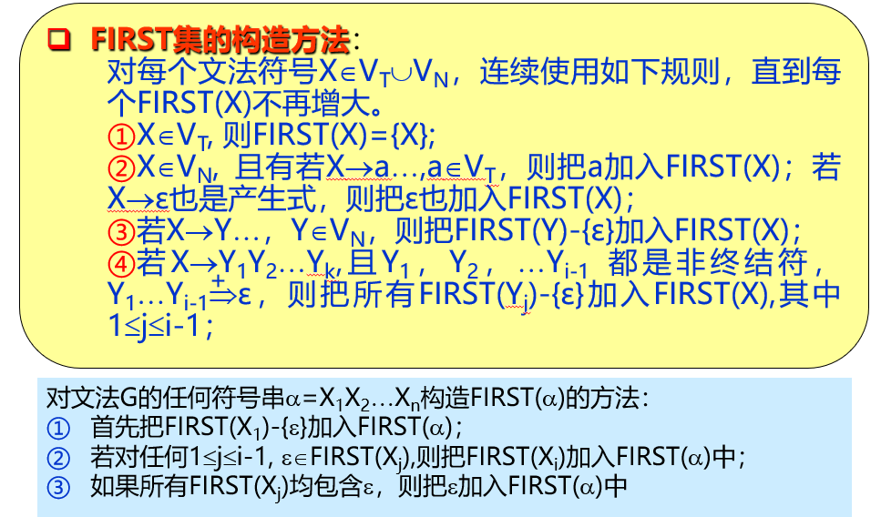

4那里应该是1<=j<=i吧？注： *表示大于1	+表示大于等于1

##### follow集构造

找产生式右边的这个字符B，这个字符后面符号的first集加入。推导符号的follow集加入(推导结果能以B结束)

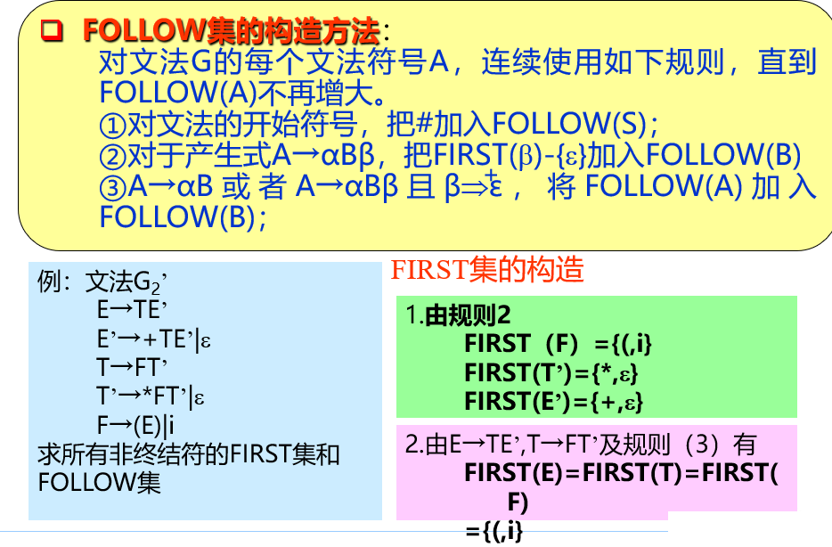

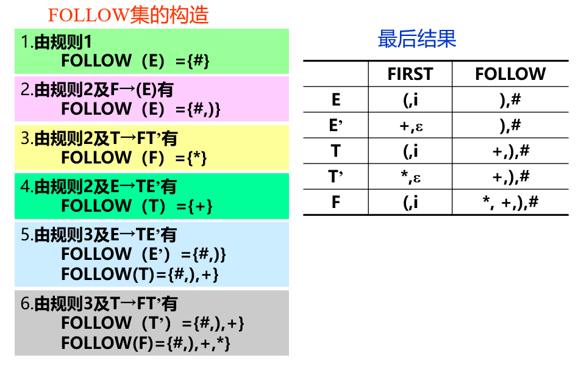

##### 预测分析表构造

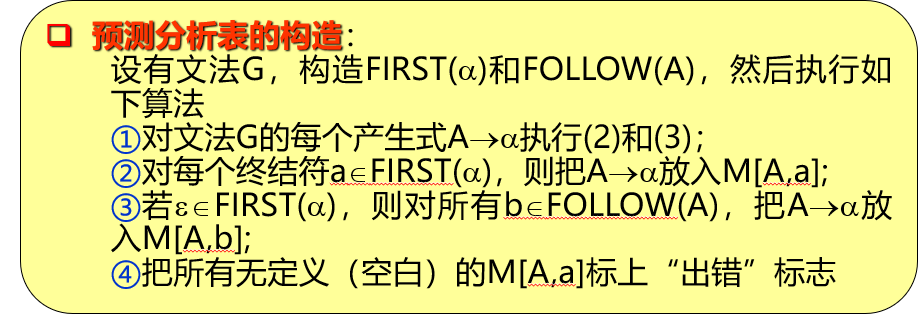

严谨的说  First集是针对候选式而说的，所以用了α区分A。求候选式First集的算法：

输入：文法G = (V,P,T,S)，α = (v ∪ T)*，α = X1.....Xn

输出：First(α)

步骤：

1、计算First(X1);

2、First(α) = First(X1) - {ε}

3、k = 1

4、while(**ε ∈ First(Xk)** and k < n)   do begin

​        First(α) = First(α) ∪ (**First(Xk+1)** - {ε})

​        k = k +1  end

5、if(k = n and ε ∈ First(Xk))  then First(α) = First(α) ∪ {ε}

思路：看前一个字符的first集中是否有ε，有的话，下一个字符的 first集-ε 也要加进去。

### 自下而上

采用栈，移进过程中观察栈顶是否形成了某个产生式的一个候选，若是，则规约，直到只剩下开始符号。

* 算符优先分析法
* LR分析法

#### 算符优先分析法

使用分析栈，当其栈顶形成**最左素短语**时，进行归约。

##### FIRSTVT集和LASTVT集

* FIRSTVT(P)集：P所可能**推导的**第一个终结符的集合
* LASTVT(P)集：P所可能推导的最后一个终结符的集合

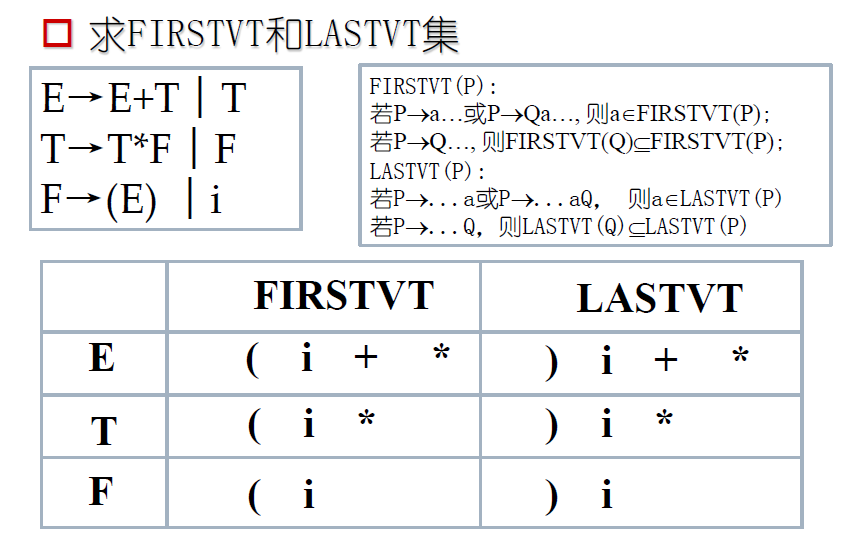

用矩阵求不容易遗漏

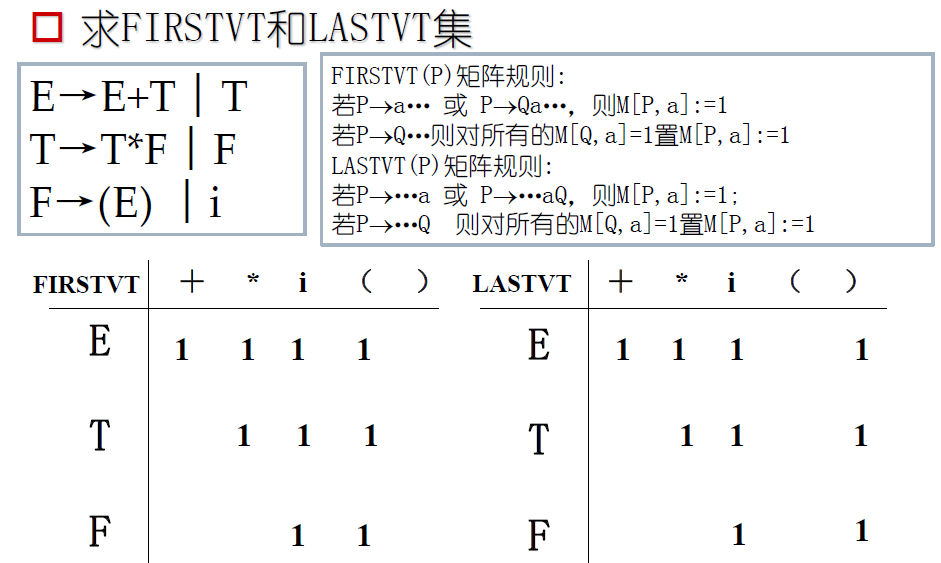

##### 优先关系表构造

这个优先关系是单方面的，也就是说这里的 “a<b” 并不意味着 “b>a”，同样的，“a=b” 也不意味着 “b=a”。

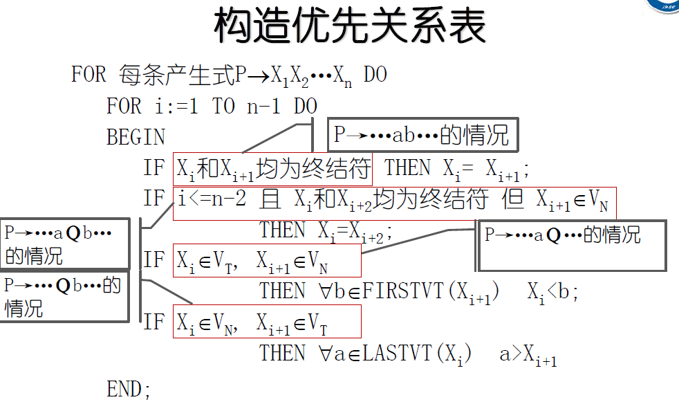

都是集合里的优先级高，终结符前面的看lastvt，后面的看firstvt

**“终结符<firstVT()”或“lastVT()>终结符”**		左边对应行，右边对应列

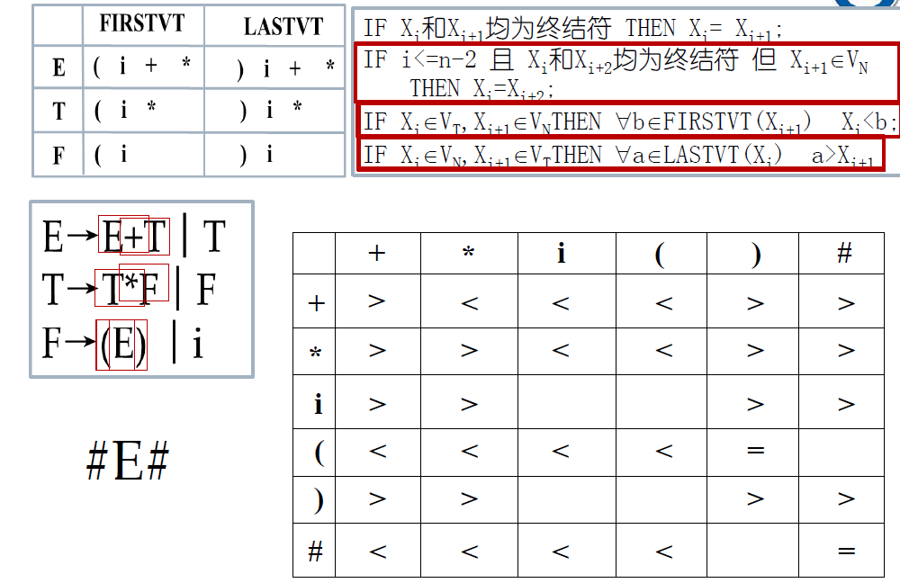

想象一个句型…aQ…..,在这个句型中只有等Q的短语规约为Q了，才有可能将…aQ….再次向上规约，因此a的优先级要小于Q产生式的firstVT(Q)集，因为我们可以断定a必定是比Q中第一个出现的终结符优先级低的，也就是说优先级a<优先级firstVT(Q)

同理，对于lastVT()，让我们想一下这种情况…..Qa…..,对于这个句型我们知道只有当Q的短语归约成了Q，我们才敢将….Qa……向上归约。这样的话就是说Q的产生式中最后出现的一个终结符的优先级必定是比a的优先级高的，也就是优先级lastVT(Q)>优先级a

#### LR分析法

##### LR(0)

https://blog.csdn.net/m0_37154839/article/details/80316089

##### SLR(1)

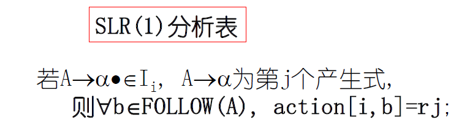

## 语义分析和中间代码生成

### 语义分析

* 语义检查：类型检查、控制流检查（break出现位置）、**一致性检查**（数组维数、变量重名、变量定义）、**越界检查**
* 语义处理：说明语句翻译（对说明语句的信息登记到符号表中），执行语句翻译（生成中间代码）

### 中间代码生成

语义子程序是某种中间代码生成程序，随着语法分析的进行，中间代码也逐步生成。

为什么要生成中间代码：**不同的机器有不同的机器码**，所以编译器会把高级语言翻译到一个低层，而这个低层又没有低到机器码这个层级。这就是中间代码（intermediate representation，IR）。**编译器的前端把高级语言翻译到 IR，编译器的后端把 IR 翻译成目标机器的汇编代码。**

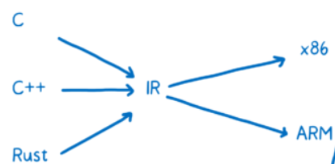

中间代码的形式多样：三地址代码、后缀式、语法树。通常使用三地址代码(或称为四元式)。

### 语法制导翻译

在语法分析的过程中，产生式对应的语义子程序对源代码进行翻译，生成中间代码。

#### 赋值语句翻译

#### 变量说明语句翻译

#### 控制语句翻译

##### 布尔表达式

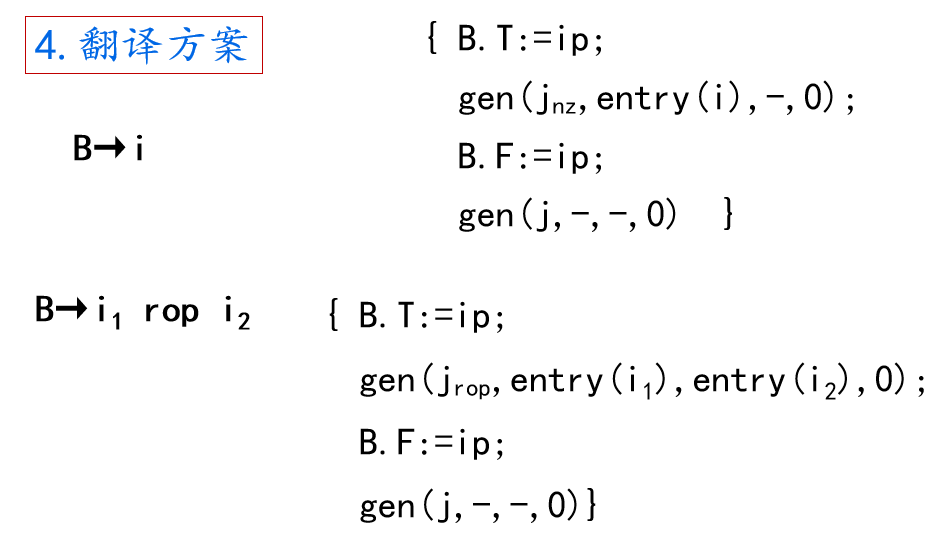

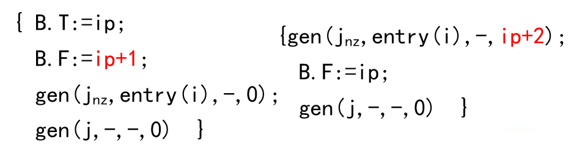

##### if语句

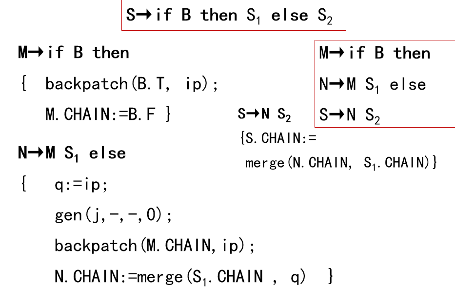

s1.chain错了 ,应该是s2.chain

**例题：**

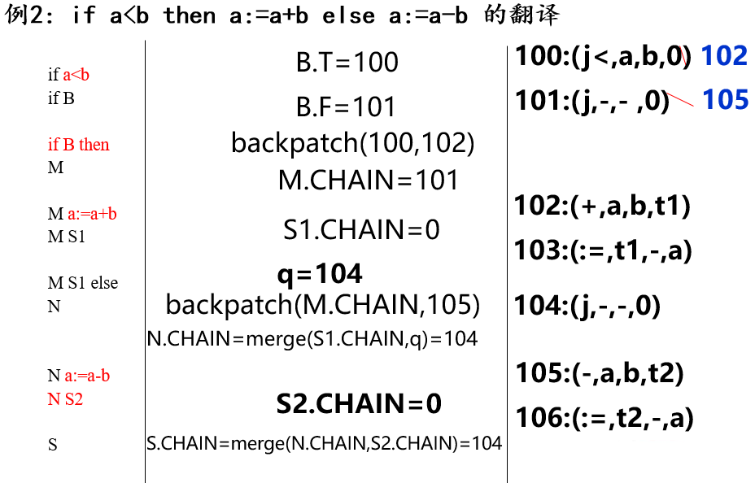

#### while语句翻译

chain记录的是要回填的那条指令的地址，code记录回填的内容

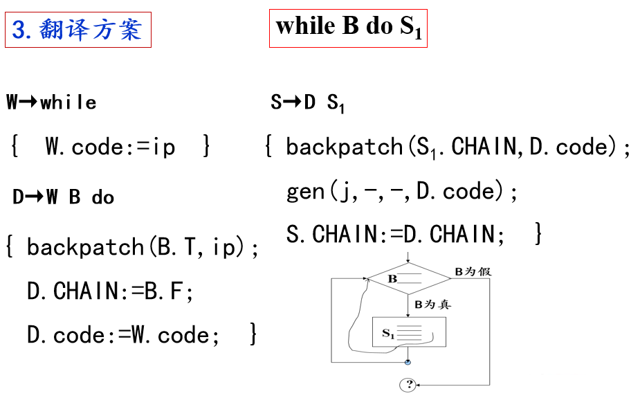

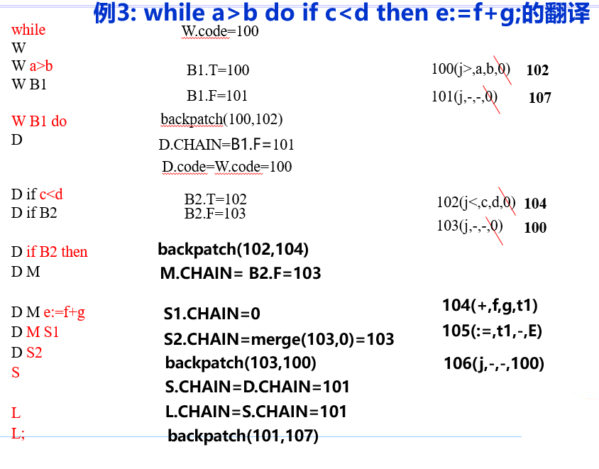

#### for循环语句翻译

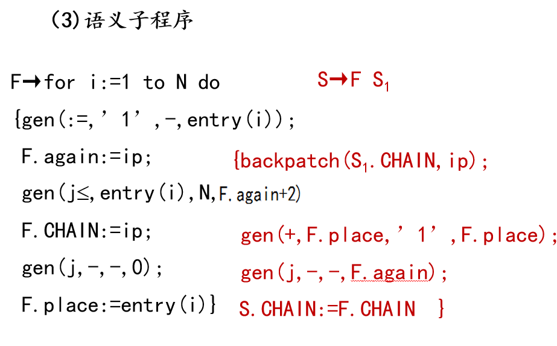

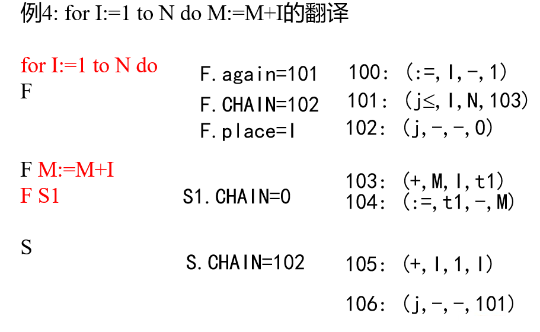

## 编译优化

等价、有效	不改变程序运行结果，提高程序的时间效率和空间的效率。

中间代码优化分为：局部优化和全局优化（基本块内和基本块外）

基本块：一段语句序列，有为一的入口语句和唯一的出口语句。所有语句的执行次数相同。

入口语句：能由转移语句转移到的语句，紧跟在条件转移后的语句

出口语句：转移语句，停止语句

### 局部优化

是基本块内的优化，常见的方法包括：

* 合并已知量
* 删除死代码：永远不会执行的分支的代码，可以删除
* 删除公共子表达式：a = b*c ; d = b*c 改为 a = b*c ; d = a 
* 删除无用赋值：a = 1; a = 2 改为 a = 2

### 全局优化

**循环定义**：循环是程序流图中有唯一入口节点的强连通子图

**如何查找循环**

基本块之间的优化，这里只讨论循环优化，常见的方法包括：

* 代码外提：循环不变运算，提到循环入口节点之前所增设的节点
* 强度削弱：加法代替乘法
* 删除归纳变量

## 目标代码生成

将中间代码翻译成等价的目标代码（机器代码、汇编码）

输入：中间代码（三地址码）

输出：目标代码（汇编代码）

目标代码的生成需要考虑：目标计算机的指令系统、寄存器分配、存储空间分配

### 循环中的寄存器分配

### 存储空间分配

* 代码空间
* 数据空间
  * 静态数据空间
  * 动态数据空间
    * 堆空间
    * 栈空间

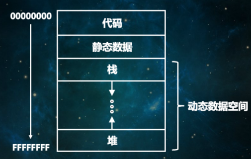

#### 活动记录

又叫栈帧。每个函数拥有自己的局部数据空间，就叫活动记录。一个函数的数据信息、管理信息都是通过活动记录存放的。通过栈式分配在栈空间种进行。

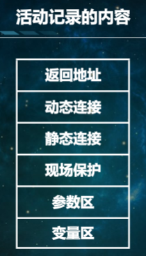

活动记录是在函数调用时动态建立，函数退出时动态撤销的。

动态连接：被调函数的活动记录中保存主调函数的活动记录的首地址，用来被调函数退出时，回复主调函数的活动记录。

#### 非局部变量

指全局变量和其他函数中定义的变量。访问方式取决于变量的作用域

静态连接：指向直接嵌套外层的最新活动记录的指针。

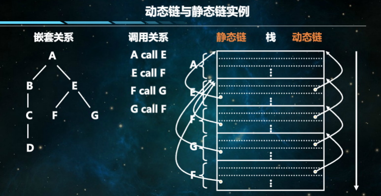

### 参数传递

#### 引址调用

将实参的地址传给形参，表达式将创建新的临时单元

#### 值调用

* 传值：将实参的计算值传给形参，作为局部变量使用
* 传结果：实参地址传给形参，另外还有一个局部变量空间 （通常不采用）
* 传值得结果：编译程序为每个形参分配两个单元；一个用来存放实参地址，一个用来作为被调用单元的局部变量，用来存放实参传递的值；实参将值传递给形参，被调用单元结束后，将形参的值再传递回实参

### 静态作用域和动态作用域

词法作用域的函数中遇到既不是形参也不是函数内部定义的局部变量的变量时，去函数定义时的环境中查询。

动态域的函数中遇到既不是形参也不是函数内部定义的局部变量的变量时，到函数调用时的环境中查。

