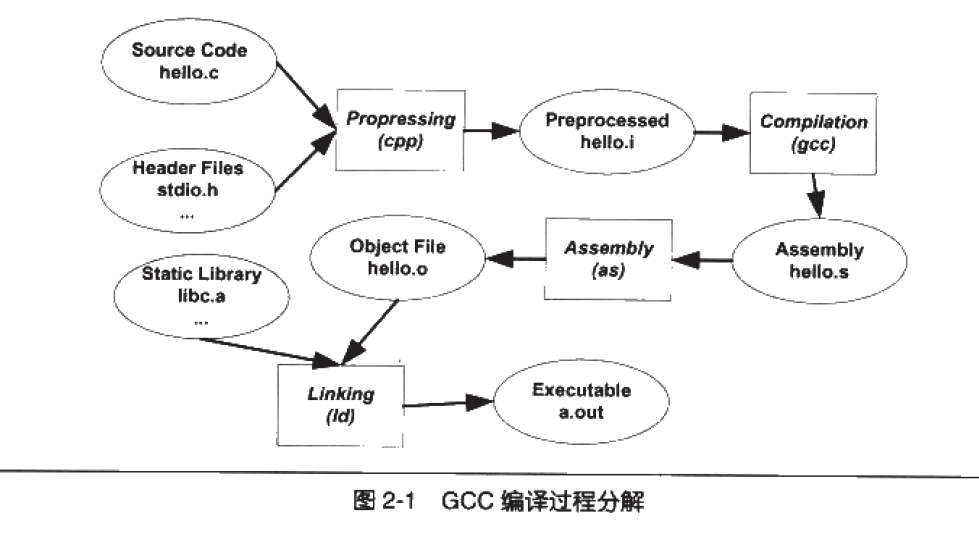

参考《程序员的自我修养——链接、装载与库》第二章

<!--more-->

## gcc hello.c 做了什么

预编译（预处理）、编译、汇编、链接

### 预编译

源代码.c文件和相关头文件，被**预编译成一个.i文件**

预编译要处理以“#”开始的预编译指令

* 删除`#define`，展开宏定义
* 处理条件预编译指令，如`#if、#ifdef、#elif、#else、#endif`
* 处理`#include`，被包含的文件插入到预编译指令的位置，这个过程可能是递归的
* 删除注释
* 添加行号和文件名标识，便于调试，编译出错了也能显示行号
* 保留`#pragma`编译器指令

### 编译

把预处理玩的文件进行一系列词法分析、语法分析、语义分析、代码优化，得到相应的**汇编代码文件hello.s**

### 汇编

将汇编码变成机器可以执行的指令，根据汇编指令和机器指令的对照表一一翻译就行

得到.o文件（目标文件）

### 链接

生成.out目标文件

## 编译器做了什么

参考编译原理，这里不多记录

### 前端（机器无关）

词法分析、语法分析、语义分析、中间代码生成

### 后端（机器相关）

目标代码生成、目标代码优化

## 链接器

### 静态链接

每个源代码单独编译，按需组装，这个组装模块（目标文件）的过程就是链接。

链接的主要过程：地址和空间分配、符号决议、重定位

各模块之间的相互引用关系，比如函数、变量地址的修正

## 可执行文件

被execve系统调用使用。用来描述进程状态机重置后的状态。状态：寄存器和内存（地址空间）

寄存器由ABI规定，OS负责设置。地址空间：二进制文件和ABI共同决定。其他调试信息，coredump信息。

### Binutils

#### 生成可执行文件

* ld, as
* ar, ranlib

#### 分析可执行文件

* objcopy/objdump/readelf
* addr2line, size, nm