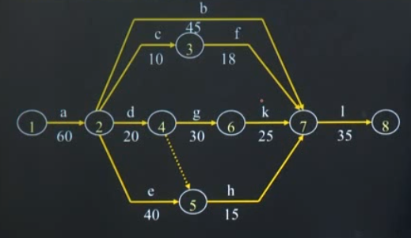

## 基本要点

* 双代号网络图绘制
* 网络计划图时间参数计算
* 寻找最短工期和关键路线的方法
* 网络优化中的时间-费用优化方法，即最低成本

<!--more-->

## 双代号网络计划图

节点：一个事项，指一个或若干个工序的**开始和结束**，相邻节点之间只能有一条箭头连接，但是可以用虚箭头连

箭头：表示工作，上面是工作名，下面是工作时间，不能形成缺口和回路，终点和起始点都有只有一个

圆圈里的数字是节点编号，编号从左到右，尾小于头

### 先行工序和后继工序

先行工序表示紧排在本工序之前的工序，且开始或者完成后才能开始本工序

后继工序表示紧排在本工序之后的工序，且本工序开始或完成后，才能做的工序。

### 虚工序

不占用时间和不消耗人力资金的资源，只为了表示相邻工序之间的逻辑关系而虚设的工序。

## 时间参数计算

* 完成项目所需要的最少时间
* 每个工序的开始和结束时间
* 关键路线及其相应的关键工序
* 非关键工序在不影响工程完成的前提下，其开始与结束时间可以推迟多久。

### 关键路线

完成各个工序所需要时间**最长**的路线（主要矛盾线），该路线上的工序是关键工序。

就是说在这条路线上，所有的工序是需要时间最多的，这些工序没有结束之前，其他工序是不可能做完的。

求解方法：**工序计算法** 

## 网络计划优化

* 工期优化
* 时间-费用优化
* 资源优化

## 资料

网络计划的多目标优化 http://tow.cnki.net/kcms/detail/detail.aspx?filename=2001011640.nh&dbcode=CRJT_CMFD&dbname=CMFDTOTAL&v=

