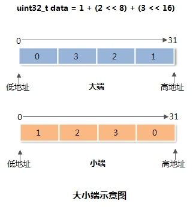
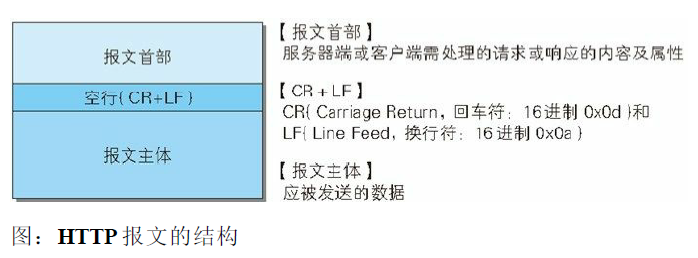
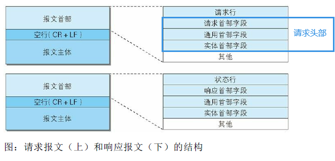
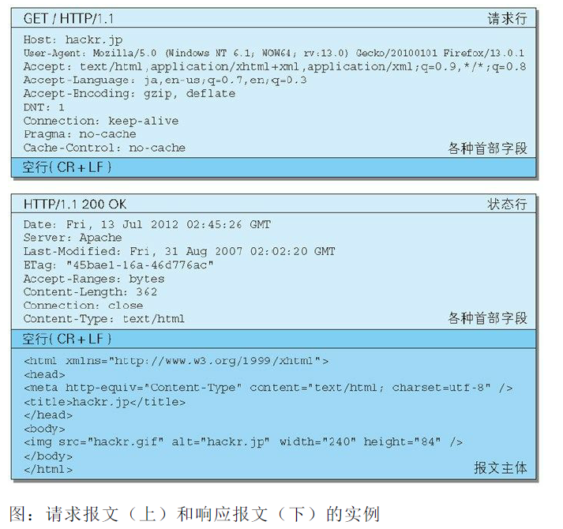
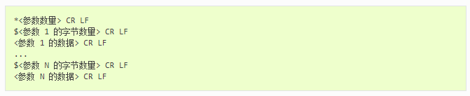
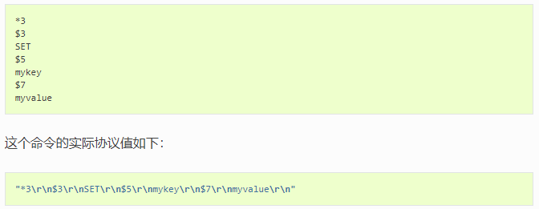

<!--more-->

## 协议分类

### 按编码方式

* 二进制协议，如tcp
* 明文的文本协议，如http，redis协议
* 混合协议（二进制+明文）

### 按协议边界

* 固定边界协议，能够明确知道协议报文的长度。便于解析，比如tcp
* 模糊边界协议，如http

## 要点

### 大小端

* 大端：从高地址开始存
* 小端：从低地址开始存
* 图解

* 网络传输一般采用大端序，也被称为网络字节序

* 大小端取决与CPU的体系：
  * 小端：x86、MOS Technology 6502、Z80、VAX、PDP-11
  * 大端：Motorola 6800、Motorola 68000、PowerPC 970、System/370、SPARC（除V9外）
  * 可配置：ARM、PowerPC（除PowerPC 970外）、DEC Alpha、SPARC V9、MIPS、PA-RISC及IA64的字节序是可配置的。

## HTTP协议

> 模糊边界的明文文本协议

### 报文结构

分为请求报文和相应报文，两种结构不一样。http报文本身是由多行数据构成字符串文本（用CR+LF作换行符，就是\r\n）。

报文组成：报文首部、报文主体（不一定有主体）

### 实例

## Redis协议

### 请求格式

* 命令本身也作为一个参数发送，如上图中的set

### 回复格式

* 状态回复：`"+"`开始，`"\r\n"`结尾的单行字符串，如`+OK`
* 错误回复：`"-"`开始，后面是错误类型
* 整数回复：`":"`开始+整数+`"\r\n"`结尾
* 批量回复：`"&"`开始表示实际回复长度，如`"$6\r\nfoobar\r\n"`
* 多条批量回复：`*`表示回复条数，与请求格式类似。

## 一个实例

用了固定边界+混合编码的策略，协议体用jsoncpp明文存储，引入魔数进行快速校验。

参考链接：https://segmentfault.com/a/1190000008740863

## 参考

https://segmentfault.com/a/1190000008740863

https://zh.wikipedia.org/wiki/%E5%AD%97%E8%8A%82%E5%BA%8F

http://redisdoc.com/topic/protocol.html

《图解HTTP》
