计算机系统结构考试复习

<!--more-->

## 量化设计与分析基础

### Flynn's分类

* SISD：串行计算机，最老的计算机类型
  * SI：一个时钟周期只有单个指令流在CPU执行
  * SD：一个时钟周期只有单个数据流用作输入
* SIMD：数据级并行，处理高度规整操作问题，如图像处理。每个处理器执行的指令一样，但是数据不一样
  * SI：一个时钟周期，所有处理单元执行相同的指令
  * MD：每个处理单元能对不同的数据元素进行操作
* MISD：不存在
* MIMD：并行计算机，线程级或任务级并行
  * MI：每个处理器执行不同的指令流
  * MD：每个处理器可以对不同的数据流进行操作

### 市场分类

* 个人移动设备
* 桌面计算机：个人计算机和工作站
* 服务器：特征：可靠性、可扩展性、吞吐量。
  * 按是否通用开放分：通用开放系统、非开放系统
* 集群/仓库级计算机
* 嵌入式计算机：区别嵌入式和非嵌入式，能否运行第三方软件

### 计算机系统结构定义

* 经典的计算机系统结构：机器语言程序员能看到的传统机器所具有的**属性**。软件、硬件界面的确定。**指令系统**
* 计算机系统结构现代定义：在满足功能、性能和价格目标的条件下，设计、选择和互连硬件部件构成计算机。
* 计算机组成：**逻辑实现**，五大功能部件的联系。着眼于机器级内**各事件的排序方式与控制方式**。
* 计算机实现：物理实现，**物理结构，器件的集成度和速度功耗**

#### 三者关系

相同系统结构的计算机，因速度要求不同等因素可以采用不同的计算机组成，如5段步骤可以顺序执行，也可以采用流水线。

相同的计算机组成也可以有不同的计算机实现。如主存可以用SRAM也可以用DRAM。

**系列机**：由一个制造上生成的具有相同的系统结构，但具有不同组成和实现的一系列不同型号的计算机。他们**系统结构相同**，有**同样的指令系统**，从机器程序设计者所看到的机器属性是相同的。但是他们**采用不同的组成和实现技术**，在低挡机上可以采用指令串行执行的方式，高档机采用重叠、流水和其他并行方式。

系列机的缺点：为了保证软件的**向后兼容**，要求体系结构基本不变，阻碍了发展。

1.指令系统  

> 指令系统的确定--------------------------------计算机系统结构
>
> 指令的实现--------------------------------------计算机组成
>
> 具体电路、器件设计及装配技术-----------计算机实现

2.乘法指令

> 是否设乘法指令--------------------------------计算机系统结构
>
> 用高速乘法器还是加法器移位器实现-----计算机组成
>
> 器件的类型、数量及组装技术的确定-----计算机实现

3.主存系统 

> 主存容量与编址方式的确定-----------------计算机系统结构
>
> 主存速度的确定、逻辑结构的模式--------计算机组成
>
> 器件的选定、电路的设计、组装技术-----计算机实现

4.什么样的系列机属系统结构，系列内的不同型号计算机的组织属组成

**透明性:** 

本来存在的事务或属性，从某个角度上看不到，则为透明。反之，不透明。
比如：
对计算机系统结构来说，存储器采用交叉存取还是并行存取、CPU内部的数据通路的宽度是8位还是16位，这些都是透明的，而对计算机组成来说这些不是透明的。
指令执行采用串行、重叠还是流水控制方式，对系统结构来说是透明的，但对计算机组成来说不是透明的。
乘法指令采用专用乘法器实现。对系统结构来说是透明的，而对计算机组成来说不是透明的。
存储器采用哪种芯片，对计算机系统结构和组成来说是透明的，而对计算机实现来说不是透明的。

### 性能评价

* 响应时间
* CPU时间计算：指令数 * CPI * 时钟周期
* 吞吐量：单位时间内完成的工作总量。在系统中增加额外的处理器可以改善吞吐量但是不会改善响应时间。但是改善响应时间可以改善吞吐量，如换用更快的处理器。
* MIPS
* SPEC率：参考计算机执行时间/机器执行时间 （越高越好）
* SM（spec mark）：$SM = \sqrt{\prod SPECRation_i}$

### 设计的量化原则

* 利用并行性：系统级、指令级、操作级
* 局部性原理：时间、空间
* Amdahl`s定律：执行优化后性能的提高，跟这种执行的使用频率有关
* 加速比：优化后性能/未优化性能  （时间取倒数）
* Fe：改进比例
* Se：改进加速比
* 改进加速比Sn计算：改进后执行时间为Tn，改进前的执行时间为To
* $(1-Fe)T_0+Fe*T_0/Se = T_n$ Amdahl定律公式

## 指令系统原理与实例

### 指令集系统结构分类

处理器内部数据的存储结构不同：堆栈、累加器、寄存器，操作数可以显式或隐式指定。

* 堆栈系统结构：操作数隐含位于栈顶
* 累加器系统结构：一个隐含操作数
* 通用寄存器系统结构：需要明确指定操作数、不是寄存器就是存储器地址
  * reg-mem系统结构：一般指令都能访问内存
  * reg-reg 或者 load-store系统结构：只有load和store能访问内存

### 存储器寻址

* 基本单位：字节寻址，都提供了字节、半字（16位）、字寻址（32位），大多数还有双字（64位）寻址。
* 大端、小端模式：小端低地址存低字节，大端低地址存高字节

* 对齐访问：一个S字节数据的地址是A，A mod S = 0。简化硬件实现，减少存储器访问
* 常见寻址方式：

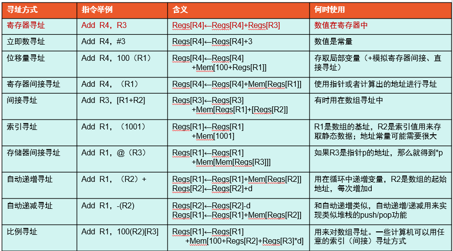

### 操作数类型

如何指定：操作码编码（最常见），操作数中用硬件解释的字段

### 指令操作

主要有：算数和逻辑运算、数据传输（load-store）、控制（条件转移、跳转、过程调用返回、陷阱）

* 控制流指令
  * PC相对寻址，优点 减少指令长度（因为偏移值小），相对地址的程序可以载入到主存的任何位置，与位置无关
  * 寄存器间接跳转：给出包含目标地址的寄存器名称，用来实现返回和间接跳转，还支持case、switch

### 指令系统编码方式

指令编码包括：操作、寄存器地址、寻址方式编码

* 变长编码：允许所有寻址方式、适合寻址方式和操作多、不适合流水线。关**注代码里大小**
* 定长编码：适合寻址方式和操作少的情况。译码简单，适合流水线、代码量大。**关注程序的执行性能**。
* 混合方法：折中

### MIPS系统结构的指令格式、寻址方式的特点

* 64位load-store系统结构
* 定长编码，有利于高效流水线
* 指令格式：32位，6位是基本操作码
* 32个64位通用寄存器R0-R31、32个浮点寄存器F0-F31，R0永远是0，R0载入无效
* 数据类型：定点：字节、半字、字、双字，浮点：32位单精度，64位双精度
* 寻址方式：16位立即数、16位位偏移量（基址寻址）、位移量0（寄存器间接寻址）、R0作为基址寄存器（16位绝对寻址）

**RISC指令系统的关键特点：**

* 所有运算的数据来自寄存器，结果也写入寄存器。
* 访存只有load和store指令
* 指令的数量少，所有指令长度相同

|                |                      CISC的8086指令系统                      |                   RISC的MIPS或ARM指令系统                    |
| :------------: | :----------------------------------------------------------: | :----------------------------------------------------------: |
|    ISA分类     |                            R-M型                             |                            R-R型                             |
|    指令长度    |                             变长                             |                             定长                             |
|    寻址方式    | 有寻址字段（立即数、寄存器、直接寻址、寄存器间接寻址、基址寻址、变址寻址、基址变址寻址、串操作寻址、相对寻址、I/O寻址） | 无专门寻址字段（立即数、寄存器寻址、位移量寻址、相对寻址），寻址方式被编码到了操作码中 |
|   操作数类型   | 定点数据类型有字节、16位字、双字、4字，字符串、近指针、压缩/非压缩BCD码 | 定点数据类型有8位字节、16位半字、32位字和64位双字。浮点数有32位单精度和64位双精度浮点数 |
|  指令操作类型  | 传送类、算术运算类、逻辑类、串操作类、程序转移类、处理器控制类 |      LOAD/STORE类、ALU操作类、分支与跳转类、浮点运算类       |
| 指令操作码编码 |                        1-2个字节编码                         |                    6位操作码加辅助操作码                     |
| 转移控制类指令 | 无条件转移指令直接或间接寻址、条件转移指令和循环控制指令相对寻址、子程序调用与返回指令 | 跳转指令拼接地址、分支指令相对寻址、跳转与链接、寄存器跳转与链接、等于零时转换 |

## 流水线技术

流水线是利用执行指令操作之间的并行性，实现多条指令重叠执行的技术。

#### 流水线分类

* 各段用时：均匀流水线、非均匀流水线
* 处理的数据类型：标量流水处理机、向量流水处理机
* 流水线规模：操作流水线、指令流水线、宏流水线
* 按功能分类：单功能流水线、多功能流水线
* 按工作方式分类：静态流水线、动态流水线（是在多功能流水线基础上划分的）
  * 静态流水线：在同一时间内，各段只能做同一种功能的工作
  * 动态流水线：同时时间内，各段可以按照不同的方式链接，同时执行多种功能。
* 按连接方式分类（有无反馈回路，有反馈的是非线性）：线性流水线、非线性流水线

#### 时空图

例子：四段指令流水线、六个任务

#### 流水线性能分析

* 吞吐率：在单位时间内流水线所完成的任务数量或输出结果的数量。$TP=n/T_k$	n是任务数，Tk是处理完成n个任务所用的时间（第一个开始到最后一个结束k+n-1）。
* 效率：$E=\frac{n个任务占用的时空区}{k个流水线的总的时空区}$ 面积之比 knt/k(k+n-1)t=n/(k+n-1)
* 加速比：顺序执行任务所用时间/流水线所用时间

* 解决流水线问题的常用方法：细分瓶颈段、重复设置瓶颈段
* 衡量流水线性能得主要指标有：吞吐率、加速比、效率

流水线定义：利用执行指令操作之间的并行性，实现多条指令重叠执行的技术。

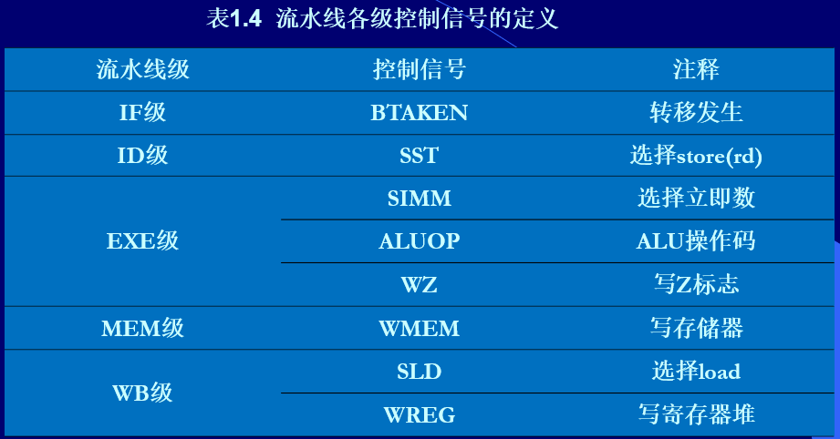

### 三种相关（冒险）及解决办法

相关分类：

* 结构相关：硬件资源的冲突
* 数据相关：后面的指令依赖前面指令的计算结果，还没算好
* 控制相关：转移指令的转移条件和目标地址没准备好

相关总是可以用停顿解决

#### 结构相关

* 多重访问寄存器堆：一个时钟周期内，WB先写，ID后读
* 多重访问存储器
  * 硬件插入停顿stall
  * 提供另一个存储器端口
  * 分开指令存储器和数据存储器
  * 使用指令缓冲器
* 没有或者没有充分流水功能部件？

#### 数据相关

WB级写寄存器堆的操作提前半个周期，在时钟下降沿打入。

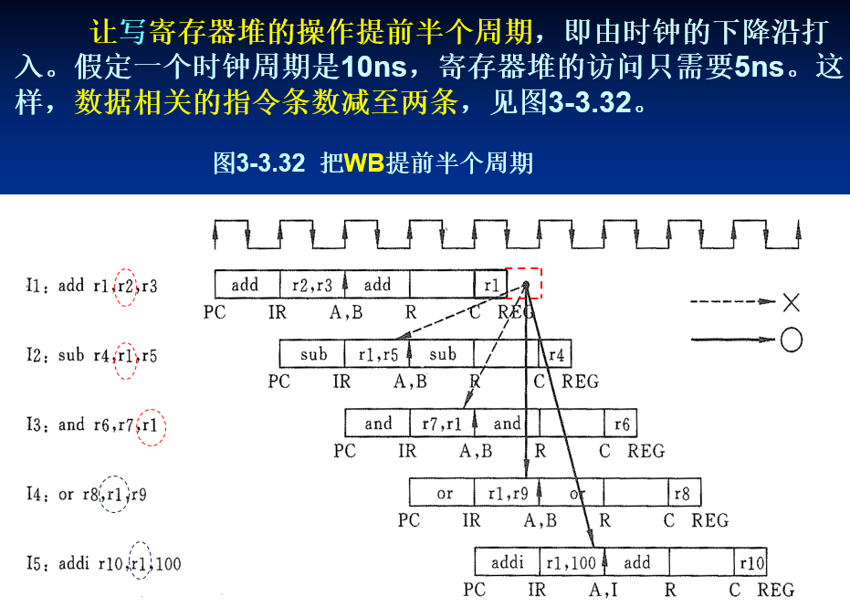

* 由编译器插入nop指令（软件方法），还是有指令进入流水线的，只是这个指令无效
* 互锁：插入stall（硬件方法1）
* 增加硬件互锁

### 流水线异常和浮点流水线

异常原因：I/O外设请求、用户OS服务请求、断点、整数算术运算溢出、浮点算数异常、缺页......

中断：用户敲击键盘、网络包到达

异常：除0、溢出、缺页

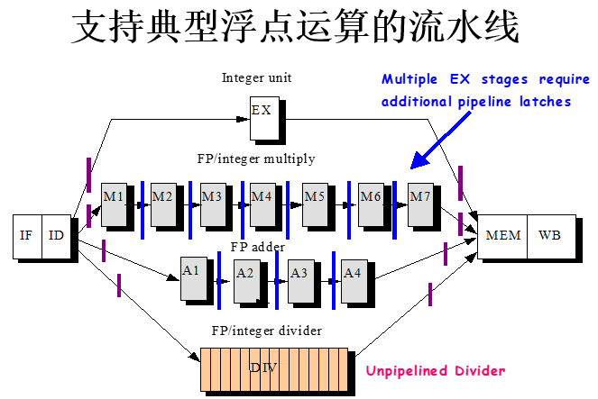

异常是一种控制冒险，操作非法、除0、结果溢出等，或者用户程序试图执行去处理异特权指令。

流水线中的异常：

* IF：取指令发生缺页、存储器访问边界未对齐、违反了存储器访问权限
* ID：未定义的或非法操作码
* EX：运算异常
* MEM：存取数据缺页、存储器访问边界未对齐、违反存储器访问权限
* WB：无

使用流水线寄存器。把PC逐级的保存下来。

精确异常：流水线停下来使异常指令前的指令能正常结束，异常指令后的指令能重新启动

非精确异常：反之，一条指令完成的时间不一定相同，指令可能乱序完成。

一般来说，整数操作异常时精确的，浮点操作异常不精确。

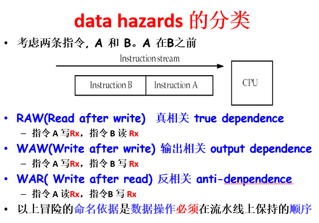

## 存储器层次结构

### Cache

**基本单位：块** cache是按照块进行管理的，cache和主存都被分割成大小相同的块，对内存和cache的访问以块为单位。

#### Cache存储器的三种映像方式

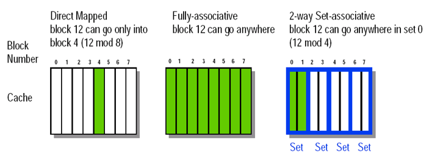

* 直接映像：块只能放在cache中唯一的位置,实现最简单。虚拟地址3部分组成
* 全相联：块可以放在cache中的任意位置,虚拟地址2部分组成
* 组相联：块能放在cache中一组中的任一位置，如果一个组有n个块，叫n路组相联。

例子：主存中编号12的块要放在cache中，cache有8个块

* 直接映像：主存中的块12能进入cache中的块4（12 mod 8），其中8是cache的块数，所以又是一路组相联

* 全相联：块12可以进入任意位置，全路组相联

* 组相联：块12可以进入第0组中的任意位置（12 mod 4）其中4是组数，即有4组

#### 块替换策略

* 随机替换
* 最近最少使用（LRU）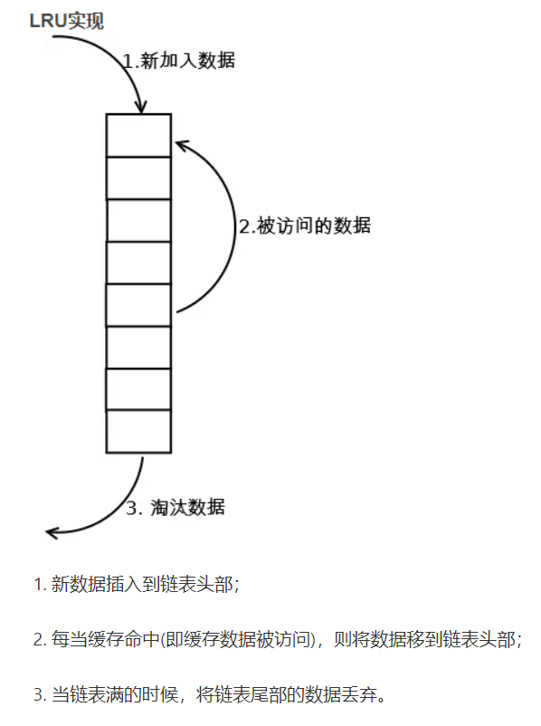
* 先进先出

#### 写策略

回答数据在写进cache的时候，是否写入主存

* 写直达(写入)：数据写cache时也写主存，cache控制位只需要valid bit（是否有效），不按写分配（写失效时，直接写入下一级存储器，read的时候才会调入cache）
* 写回（不写入）：写cache时不写主存，需要valid位和dirty位（是否被修改），写缺失（要写的块不在cache内）的时候采用写分配策略（把缺失块调入cache再写）。采用的是写分配

写停顿

对cache写的时候，要写的块不在cache内：

写分配：调入cache，再写

不按写分配：直接写入内存

### 性能

* CPU执行时间

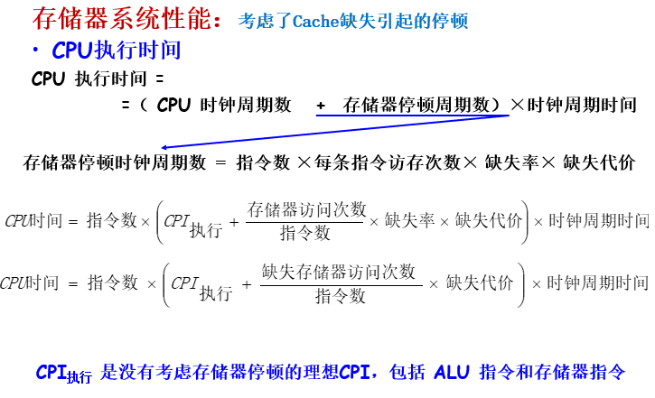

CPU性能取决与三个因素：IC * CPI * 时钟周期时间

* 平均每条指令的存储器停顿：

  =每条指令的缺失次数L1*每条指令的缺失代价

  =每条指令的缺失次数L1*（命中时间L2+每条指令缺失次数L2 * 缺失代价） 

  =每条指令缺失次数L1*命中时间L2+每条指令缺失次数G2 * 缺失代价L2

  L是local，G是global

* 平均存储器访问时间

  = 命中时间+缺失率*缺失代价

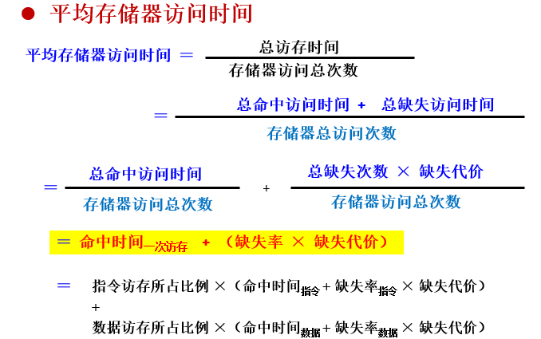

### 从平均访存时间改善cache性能

* 减少缺失率：增加块大小、增大cache容量、更高相联度、编译优化
  * 编译优化：指令优化（预测转移发生），数据优化（合并数组、循环交换、循环融合、分块）
* 减少缺失代价：多级caches、关键字优先、提前重启动、读缺失优于写缺失、合并写缓冲、牺牲缓冲
  * 关键字优先：CPU只要块中的一个字，从存储器将缺失的字尽可能快的送到CPU，CPU继续执行同时填方块中的其他字。
  * 提前重启动，只要块中请求的字到达，就送到CPU。
* 通过并行减少缺失代价和缺失率：非阻塞caches、硬件预取、编译预取
* 减少cache的命中时间：使用小的和简单的caches、避免地址转换、流水线cache访问、路预测、踪迹caches

#### 缺失分类

* 强制缺失：首次访问缺失，与cache大小无关，更大的块可以较少强制缺失率（空间局部性）
* 容量缺失：cache容纳不了一个程序的所有块。通过增大cache容量减小
* 冲突缺失：块被映射到了同一组，相联度越高，cache容量越大，冲突失效就越少。
* 一致性缺失

#### 缺失

增大块容量：减少冲突缺失、增加缺失代价、增加冲突缺失（块少了）

增大cache容量：减小容量缺失、减少冲突缺失

更大的相联度：较小了冲突缺失

2：1经验法则 一个容量为N的直接映射cache的缺失率 = 一个容量为N/2的2路组相联cache的缺失率。

### 改善主存储器组织的性能

* 延迟：很难减小
* 带宽：采用新的组织
  * 增加主存储器带宽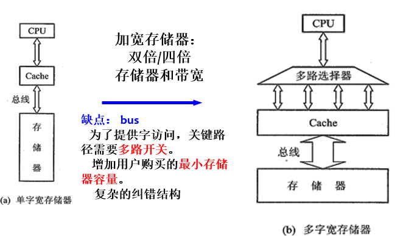
  * 简单交叉存储器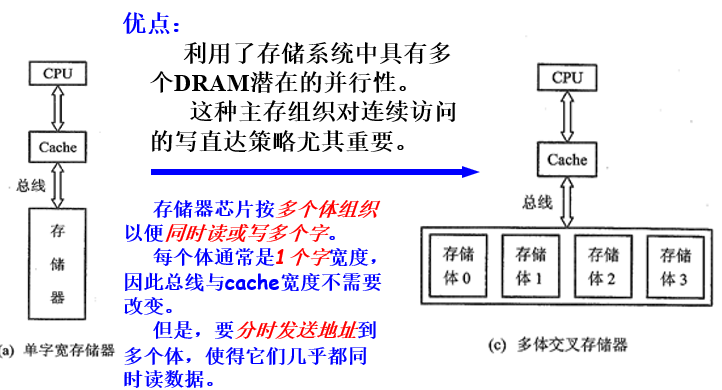

#### 增加主存带宽

### 虚拟存储器

* 段式：可变大小的块
* 页式：固定大小的块

映像策略：采用全相联策略，因为访问磁盘太慢了，要尽可能降低缺失率。

根据局部性原理，大多OS采用LRU替换策略。

写策略采用写回方式，因为访问磁盘很慢。

快表：一个特殊的cache，TLB，存放最近用过的页表项。组成：标识、数据。标识中存放的是虚地址的一部分，而数据部分中存放物理页号（组成物理地址）、存储保护信息以及其他一些辅助信息

例子：TLB采用直接映射

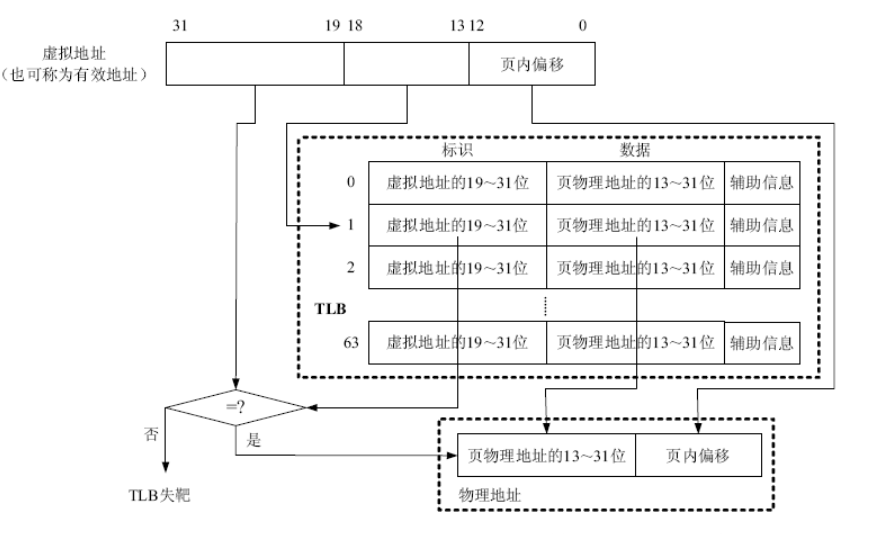

因为页大小是8KB，所以虚拟地址的0-12bit作为页内地址偏移。TLB表有64项，所以虚拟地址的13-18bit作为TLB表项的索引。假如虚拟地址的13-18bit是1，那么就会查询TLB的第1项，从中取出标识，与虚拟地址的19-31位作比较，如果相等，表示TLB命中，反之，表示TLB失靶。TLB失靶时，可以由硬件将需要的页表项加载入TLB，也可由软件加载，具体取决于处理器设计。

例：TLB采用全相联映射

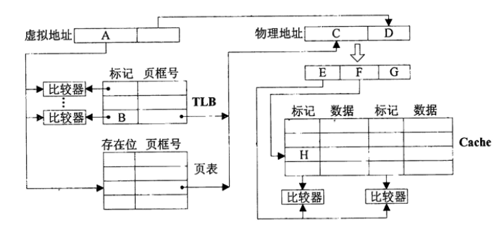

https://www.nowcoder.com/questionTerminal/c6fd7f1a40d14350bd976d951384b335

区分全相联和直接映像

全相联可以放在任何一个位置，直接判断标记，虚拟地址只需要分两部分

直接映像通过唯一的序号确定位置，但是可能有冲突，所以还是需要标识位，虚拟地址需要分三部分

### 多线程和多处理器

#### ILP和TLP

ILP指令级并行：instruction level parallelism

隐式并行

局限性：

* 各种相关限制了每个始终周期能发射的指令数
* 分支预测的准确性
* 寄存器重命名的能力

TLP线程级并行：thread level parallelism

显式并行

一个线程是有自己的指令代码和数据的过程。每个线程都有用于执行的必要的状态（包括指令代码、数据、PC、寄存器状态）

####  超标量、粗粒度、细粒度和SMT

粗粒度：仅在长空闲周期时才切换线程。

细粒度：可在每个时钟周期切换线程，使得线程交替执行。

SMT：同时多线程 simultaneous multi-threading，结合了多发射、在ILP和TLP上动态调度指令的功能，可在一个始终周期发射不同线程的指令。

**超标量**（superscalar）CPU架构是指在一颗处理器内核中实行了指令级并行的一类并行运算。这种技术能够在相同的CPU主频下实现更高的CPU吞吐率（throughput）。

#### 多处理器（MIMD）的两种分类结构

集中共享存储器架构：也成为均匀存储器访问UMA结构，也可成为对称型多处理机SMP，一个存储系统为每个处理机提供相同的访问时间。

分布式存储器架构：多存储系统，多IO，非均匀存储器访问NUMA结构

#### 同构多核与异构多核

芯片级并行