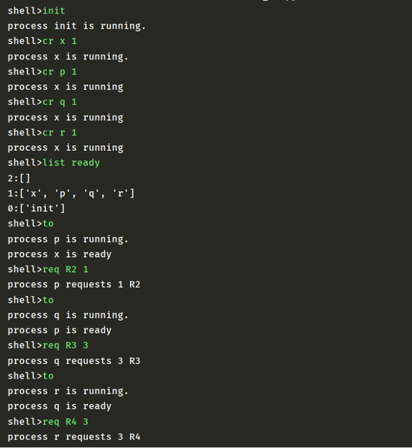
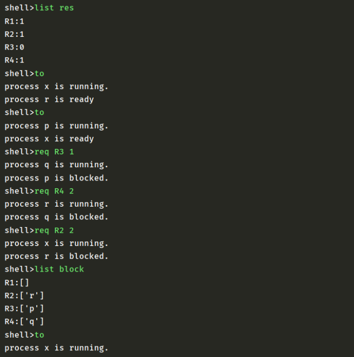
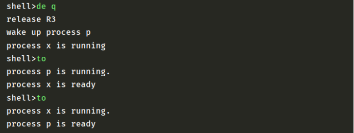

UESTC操作系统课程实验：进程与资源管理器设计

<!--more-->

### 实验环境

本程序使用python语言实现，在Windows平台进行测试并与相关环境兼容。以下环境和包需要在运行程序前预先安装：

* Python 3
* collections

### 运行demo

1. 在命令行执行命令：

   `python ./main.py`

2. 程序将会模拟shell终端读取输入命令：

   `shell>`

3. 可支持命令如下：

   ```c
   -init
   -cr <name> <priority>(=1 or 2) // create process 
   -de <name> // delete process
   -req <resource name> <# of units> // request resource
   -rel <resource name> <# of units> // release resource
   -to // time out
   查看进程状态和资源状态的命令
   -list ready //list all processes in the ready queue
   -list block // list all processes in the block queue
   -list res //list all available resources
   -pr <name> //print pcb information about a given process.
   ```

   

4. 首先你需要先使用`init`命令初始化资源和创建`init`进程，该命令是必须的。

5. 接下来你可以使用`cr` `de` `req` `rel` `to`等命令进行进程或资源的操作，并使用`list`命令查看就绪队列和阻塞队列的状态，使用`pr`命令打印指定进程的pcb信息，使用`exit()`命令退出shell。

6. enjoy! :happy:

### 代码简单说明

#### 定义PCB和RCB

```python
class PCB:
    def __init__(self,priority):
        self.res = {'R1': 0, 'R2': 0, 'R3': 0, 'R4': 0}#占用资源情况
        self.status = "ready"#进程状态
        self.parent = None#父进程
        self.child = []#子进程
        self.priority = priority#进程优先级
        self.req = 0
class RCB:
    def __init__(self,total):
        self.waitList = []
        self.total = total#资源总量
        self.num = total#当前资源可用量
```

#### 进程管理函数

包含：

* 创建进程`create` 
* 进程销毁`destroy`

```python
def create(pid,priority,cPid):
	#pid为要创建进程的id,priority为要创建进程的优先级
	#cPid为当前正在执行进程的id
    if(cPid!=None):#如果当前存在正在运行的进程
        ready[cPid].child.append(pid)#则要创建的进程加入到当前进程的子进程列表里
    pcb = PCB(priority)#初始化pcb对象，创建进程
    pcb.parent = cPid#新进程的父节点为当前运行的进程
    ready[pid] = pcb#将新进程加入到readylist中
    scheduler()

def destroy(pid):#要撤销的进程号
    dict = {}
    dict.update(ready)
    dict.update(block)#dict维护了所有的进程记录，包括就绪态进程和阻塞态进程
    p = dict[pid]#根据pid找到该pid对应的PCB对象
    killTree(p,pid)#进行递归的销毁
    scheduler()

def killTree(p,pid):#要删除的PCB和pid
    dict = {}
    dict.update(ready)
    dict.update(block)#维护存储所有进程记录
    for childPid in p.child:#遍历要删除的进程的子进程
        killTree(dict[childPid],childPid)#递归删除
    if pid in ready.keys():#如果该进程在readylist里
        for rid in ready[pid].res.keys():#释放该进程占用的资源
            if ready[pid].res[rid]!=0:
                release(rid,ready[pid].res[rid],pid)
        ready.pop(pid)#将该进程从readylist中删除
    else:#如果该进程在blocklist中
        temp = block[pid].res#找到该进程在blocklist中存储的pcb
        for rid in temp.keys():#遍历该进程占用的资源进行释放
            if pid in block.keys() and temp[rid]!=0:
                release(rid,block[pid].res[rid],pid)#释放资源
        for rid in temp.keys():#在rcb的waitlist中移除该进程
            if pid in res[rid].waitList:
                res[rid].waitList.remove(pid)
        block.pop(pid)#把该进程从blocklist中删除
```

#### 资源管理函数

包含：

* 资源的请求函数`request`
* 资源释放函数`relResource`，内部调用函数`release`

```python
def request(cPid,rid,n):
	#参数含义：
	#cPid：当前正在执行的进程id
	#rid：请求资源的id
	#n:请求资源的数量
    if(res[rid].num>=n):#如果当前可用资源数量大于请求量
        res[rid].num -=n#则进行资源的分配，更新可用资源数
        ready[cPid].res[rid] +=n#p占有的资源数更新
        print("process "+cPid+" requests "+str(n)+" "+rid);#打印提示信息
    else:#如果剩余资源数不足以分配
        if(n>res[rid].total):#如果大于资源总量，提示error，拒绝分配
            print("error")
            return
        ready[cPid].status = "blocked"#请求量小于总量但大于可分配量，该进程转为阻塞态
        block[cPid] = ready[cPid]#将该进程从readylist移动到blocklist
        block[cPid].req = n#记录阻塞时，请求的资源量
        ready.pop(cPid)#将该进程从readylist中移除
        res[rid].waitList.append(cPid)#在要请求的资源的waitlist中加入该进程
        scheduler()
        print("process "+cPid+" is blocked.")#打印提示信息
        
        
def relResource(pid,rid,n):
    #print(list(ready.keys())[0])
    cP = ready[list(ready.keys())[0]]#获取当前正在执行的进程PCB
    cP.res[rid]  = max(cP.res[rid]-n,0)#更新该进程的资源占用情况
    release(rid,n)#进行资源的释放
    
    
def release(rid,n,pid):#针对一种资源的释放
#参数：rid要释放资源的id
#n:释放的数量
#pid：释放该资源的进程id
    rcb = res[rid]#获取rid对应的rcb对象
    print("release "+rid)#打印提示信息
    res[rid].num +=n#资源的可以量增加
    pop = []#初始化一个空列表，记录可以从阻塞态转为就绪态的进程号
    for id in res[rid].waitList:#检查block_list里的进程能否ready，遍历该资源的waitlist
        if block[id].req<=res[rid].num and id!=pid:#如果可以转为ready态
            res[rid].num -=block[id].req#更新资源的剩余量
            pop.append(id)#记录可以转为就绪态的进程号
    for id in pop:#遍历刚刚得到的可以转化为就绪态的进程号
        block[id].req = 0#请求量更新
        ready[id] = block[id]##从blocklist中移动到readylist
        block.pop(id)
        res[rid].waitList.remove(id)#将该进程从waitlist中移除
        print("wake up process " + id)#打印提示信息
        ready[id].status = "ready"#更新进程状态
```

#### 进程调度与时钟中断函数

包含：

* 调度函数`scheduler`
* 抢占函数`preempt`
* 时钟中断函数`timeOut`

```python
def scheduler():
    i = 0
    l2 = [];l1 = [];l0 = []#初始化三个列表，分别记录2 1 0三个优先级的进程id
    for pid in ready:#遍历readylist
        if i==0:#获取当前正在执行的进程id和PCB
            cPid = pid
            cPCB = ready[pid]
            i +=1
        if(int(ready[pid].priority)==0):
            l0.append(pid)
        elif(int(ready[pid].priority)==1):
            l1.append(pid)
        elif(int(ready[pid].priority)==2):
            l2.append(pid)
    list = l2+l1+l0#将三个列表按优先级顺序拼接，此时list中的第一个进程就是最高优先级且根据RR原则将要调度的进程
    if(len(list)==0):#如果列表为空，则结束调度
        return
    hpP = ready[list[0]]#highest priority process获取最高优先级且根据RR原则将要调度的进程
    if(int(cPCB.priority)<int(hpP.priority) or cPCB.status!="running" or cPCB==None):#如果满足抢占条件
        preempt(cPid,list[0])#则进行抢占
    else:
        print("process "+cPid+" is running")
        
        
def preempt(oldId,newId):
	#参数：
	#oldId：原先正在执行的进程id
	#newId:要抢占cpu的进程id
    ready.move_to_end(oldId)#将原进程移动到readylist的队尾
    ready.move_to_end(newId, last=False)#将要抢占cpu的进程移动到readylist队首
    ready[oldId].status = "ready"#更新进程的状态
    ready[newId].status = "running"#更新进程的状态
    print("process "+newId+" is running.")#打印提示信息
    
def timeOut(cPid):#传入当前运行的进程名
    ready.move_to_end(cPid)#将当前正在执行的进程移动到readylist队尾
    ready[cPid].status = "ready"#更新进程状态
    scheduler()
    if list(ready.keys())[0]!=cPid:#打印提示信息
        print("process "+cPid+" is ready")
```

### 测试效果





