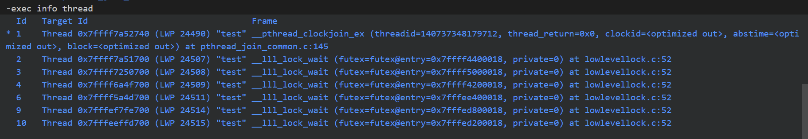
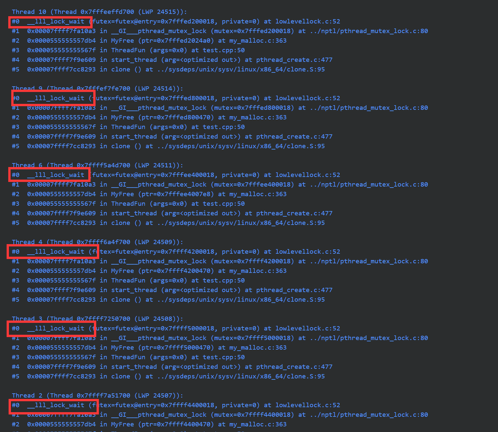
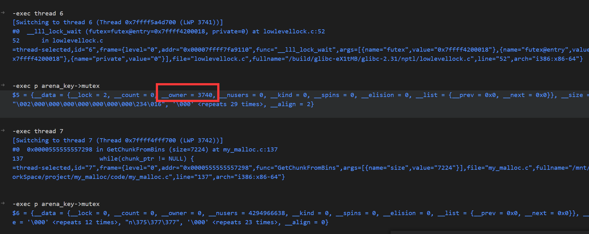

mutex互斥锁是借助与汇编指令cmpxchgl实现的，是汇编级别的CAS，如果swap不成功，则调用__lll_lock_wait让线程调度，让出cpu。

<!--more-->

C++ 标准库`std::mutex`只是`pthread_mutex_t`的封装，所以看pthread_mutex_t就可以。

## 如何调试死锁

> 写多线程malloc不知道为什么死锁了，记录下调试过程

使用`gdb`调试，在`vscode`的调试控制台下使用`gdb`命令需要加上`-exec`前缀

运行程序，发现不在打印日志，怀疑死锁，SIGTRAP暂停程序

* 使用`info thread`查看线程情况

前面带\*的是正在运行的线程，不带\*的大概率就是阻塞的线程了，观察后面的栈帧情况，发现程序运行在`__lll_lock_wait`请求获得锁，说明2、3、4、6、9线程都阻塞在这里了。（LWP后面跟的就是线程号）。

* 使用`thread apply all backtrace`查看所有线程的栈帧信息

`backtrace`是打印栈帧的命令，`thread apply all` 可以对所有线程使用后面跟随的指令，有`lock_wait`就是发生了死锁的线程

* 然后使用`thread *`切换到不同的线程，打印出mutex变量查看owner的线程号：

* 检查是否有循环持锁的情况，再检查代码逻辑
* （最后都是程序逻辑写错了）

## 参考

https://kernel.taobao.org/2020/11/talking_of_atomic_operations/
